# 复杂场景下多模态情感预测的数学建模与算法设计

## 摘要

针对复杂场景下文本、语音和视觉信息存在时序差异、局部缺失及决策依据难以追溯的问题，本文围绕多模态特征提取与对齐、局部缺失条件下的情感预测以及可解释性分析开展建模研究。首先，保留附件1的100条原始样本及其原始文本、标签和媒体数据，采用冻结BERT、低层声学描述子和面部行为特征建立可追溯的变长特征流程，并通过候选时间区间聚合形成词级特征视图。结果覆盖100条样本、1932个原词；视觉特征可用词数为1824个，仍有108个词存在视觉不可用情况，其中5条样本的词级视觉特征全部不可用，词级语义对应关系暂未获得人工核验。

其次，针对局部连续缺失，构建输入端文本遮挡、缺失掩码、轻量时序卷积和动态门控融合的双任务模型，同时预测情感极性和强度。代表模型在728条开发验证样本上的Accuracy为62.77%；冻结后在727条测试样本上正确483条，Accuracy为66.44%，Macro-F1为0.6304，MAE为0.6259。测试清洁加42个缺失场景的平均Accuracy为63.52%，但中性召回率仅46.20%。三种子验证43场景Macro-F1为0.5568±0.0214。终检前25次开发后，又独立实施轻量跨模态注意力、整模态随机失活和LoRA共9次拟合，仅使用训练与验证划分。三项均未通过综合替换门槛；随机失活改善整模态缺失压力表现，却降低清洁分类与中性召回。故保留原模型，不将已知测试成绩作为新候选的独立证据。

最后，采用积分梯度、局部连续块干预和匹配随机块对照解释冻结模型。60条验证样本支持特征干预下的平均局部忠实性，但存在个体反例和参考敏感性，不能等同于真实情感因果证据。附件4完成20条预测和480条局部证据，并自行重建文本候选时间以支持原媒体回看。单复核者对160条文本配置记录全部核查，其中144条候选可用、8条内容不对应、8条无法判断；90.00%仅为候选可用记录比例，不是预测或定位准确率。官方音视频槽位来源仍未核验，未采集独立人工时间边界，不报告边界误差。上述限制与异常保留于冻结结果。

**关键词：** 多模态情感预测；局部模态缺失；时序对齐；动态门控融合；可解释性

## 1 问题重述与总体思路

### 1.1 问题背景与任务

#### 1.1.1 多模态情感识别的现实困难

情感识别的目标是从一段自然表达的片段中判断说话者的情感倾向与强度。与仅依赖文字的传统文本分类不同，本题要求同时利用三种信息来源：文本的字面内容、声音的韵律与音质变化、以及面部的表情动作。这三者并非同一信息的三种冗余编码，而是互为补充又互相冲突的证据来源。例如一句字面上中性的陈述，可以通过语调的下沉传达不满；一段字面积极的表述，也可能因说话者面无表情而被削弱。因此，多模态情感识别本质上是一个证据融合问题：模型需要学习在何种情境下信任哪一路信息。

然而把这三路信息真正用起来，在工程上远比"提取特征然后拼接"复杂。本题的真实困难可以归纳为四点。

**第一，三种模态的采样率与表示维度天然不对齐。** 文本以词为单位、每词对应一个768维语义向量；声学以帧为单位、每帧25维韵律描述；视觉同样以帧为单位、每帧25维面部动作描述。同一句"我不喜欢这部电影"，文字上只有若干离散词元，声音上却是连续数百帧的波形包络，画面上又是另一套独立的帧序列。要把它们送进同一个网络，必须先建立统一的时间或位置坐标。而这个坐标本身是否可信，就是一个独立的问题。

**第二，局部缺失是常态而非例外。** 真实场景中，语音可能被噪声掩盖、面部可能转出画面、文本可能不完整。缺失往往不是"整条样本丢掉某一路"，而是"某一路在某个局部区间内缺失"。这类局部缺失对模型的影响与整模态缺失完全不同：整模态缺失时模型只需调整融合权重，而局部缺失要求模型在序列内部区分"这里是有效观测"与"这里是缺口"，并用同一套参数同时处理两种情形。模型必须被显式告知缺失位置，否则无法区分"数值恰好为零"和"根本没有观测"。

**第三，特征位置与原始媒体之间的映射关系往往不可验证。** 题目提供的对齐版特征已经把三模态对齐到统一的50个槽位，但官方并未说明这50个槽位到原词、到秒、到帧的对应规则。这意味着我们可以在这50个位置上做实验，却无法断言第17个槽位对应原始音频的第几秒。这一限制直接约束了第三问能给出的结论强度：我们可以说明"模型对哪一段特征敏感"，但不能声称"这段特征对应视频中的哪一帧画面"。

**第四，也是最重要的一点——可信度必须分层声明。** 一个"提取成功"的特征、"一个"数值非零"的归因、"一个"预测为正向"的输出，三者所承载的可信度并不相同。工程上可用的特征不代表语义上正确的对齐；数值上完备的归因不代表因果上真实的贡献；预测分布上的高概率也不代表未经校准的置信度。本文的核心方法论主张正是：把不同层次的结论分开陈述，只在真正有真值的层次上报告指标，在无真值的层次上只报告分布与边界。

#### 1.1.2 三个任务的具体要求

**问题1**要求从附件1的100条原始样本出发，自行完成三模态特征提取，并建立可追踪的时序关系。这里的"可追踪"是关键词：不是把特征提取出来就结束，而是要求每一个词级向量都能回答"它由哪些原始观测、经过什么规则聚合而来"。为此需要保留原始媒体、保存逐词观测索引与权重、记录每次提取的成功与失败状态。

**问题2**要求在附件2已经对齐的三模态特征上，建立局部缺失条件下的模型。这里的"局部缺失"是题目的核心约束，不是数据预处理环节。缺失分为两种来源：一是附件2中本来就存在的原生缺失，二是要求建模者主动构造的合成缺失。对后者，题目要求考察七种模态组合与不同缺失位置的交叉影响。同时，模型必须完成双任务：情感极性分类（负向、中性、正向三分类）与情感强度回归。

**问题3**要求在模型冻结之后，解释它的预测，并为附件4的20条样本提供关键证据。这里的"解释"必须可检验：不能只画出一张热力图就宣称模型关注的区域找到了，而要说明关键证据相对于匹配的随机证据是否真的更强，以及在什么条件下这一结论会失效。

**三个任务之间的边界。** 需要特别强调：附件3与附件4不提供真值标签，因此不能计算其准确率；问题1自提的特征不替换问题2、问题3所使用的官方特征；三模态序列长度相等也不能证明每一行对应同一个原词或同一时刻。本文在整个论文中反复回到这一边界，目的是避免把"看起来合理"当作"已经被验证"。

### 1.2 总体技术路线

本文按三个任务分设三个模块，模块之间以"冻结"为接口：前一个模块的输入格式与输出定义确定后即冻结，后续模块不在其基础上追加实验性改动，从而保证每个模块的结论都可以独立追溯。

**问题1模块：特征提取与候选时序对齐。** 输入是附件1的原始文本、音频与视频；输出是逐词的三模态向量、逐词的可用性标记，以及一套独立的提取质量记录。这个模块的设计要点是"三个层次分别记录"：第一层记录提取是否成功（工程可用性），第二层记录候选时间区间的几何覆盖（名义覆盖率），第三层记录语义对应是否经过人工核验（语义可信度）。本文刻意不把这三层合并成一个"对齐质量分数"，因为合并会掩盖不同来源的误差。

**问题2模块：局部缺失下的双任务预测。** 输入是附件2的官方对齐特征与标签；输出是极性分类概率、强度回归值，以及在43种缺失场景下的性能记录。这个模块的核心设计是在**BERT输入端**施加文本缺失，而不是在输出端遮挡已经计算好的文本特征。原因在于：如果只遮挡输出特征，被遮挡内容的语义信息可能已经通过自注意力传播到了其他位置的表示中，从而造成信息泄露，使模型在缺失条件下表现出虚假的鲁棒性。为保证这一点可验证，本文为训练与验证各生成独立的受损文本缓存，并绑定实际编码输入、掩码与编码器配置，只有完全相同的受损文本才允许复用。

**问题3模块：冻结模型的解释与验证冻结之后**，问题3不再训练任何参数。它以积分梯度给出逐特征的一阶归因，再构造"连续关键块"——即归因绝对值最大的连续特征区间——并用位置匹配的随机块作为对照。判断标准不是"关键块的归因值大"，而是"关键块的干预效应显著高于匹配随机块的干预效应"。这一设计把解释从"展示"变成"可证伪的检验"。

三个模块的总体流程如图1所示，图中同时标出了各模块的输入来源、输出形式以及它们之间的冻结关系。

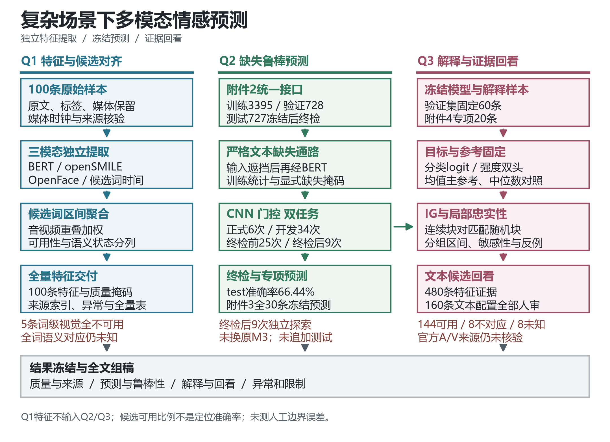

**全文的组织逻辑。** 第2章说明数据范围、基本假设与符号；第3至5章分别对应三个任务，每章先给方法、再给结果、最后给边界；第6章集中讨论方法价值、主要限制与后续改进条件；第7章给出结论。把"限制"单列一章而不是零散地插在各处，是为了让读者能够一次性看清本文结论的适用边界，而不是在大量正面结果中被稀释。

## 2 数据说明与基本假设

### 2.1 数据范围与使用方式

本题提供四个附件，其规模、用途与标签使用方式差异明显，必须分列说明。表1给出完整对应关系。

表1 数据范围与使用方式

| 数据 | 样本数 | 主要用途 | 标签使用 |
|---|---:|---|---|
| 附件1 | 100 | 原始提取与候选对齐 | 仅核对原字段 |
| 附件2训练集 | 3395 | 模型拟合与统计估计 | 监督学习 |
| 附件2验证集 | 728 | 早停、选型与结果报告 | 内部验证 |
| 附件2测试集 | 727 | 冻结后正式性能终检 | 预测封存后计分 |
| 附件3 | 30 | 冻结专项预测 | 无真值 |
| 附件4 | 20 | 冻结预测及限定解释 | 无真值 |

**关于测试集的访问边界，本文采取保守且明确的声明。** 验证集用于早停、配置选择与开发结果报告；正式模型冻结后，对727条测试样本进行一次正式性能终检，验证成绩与测试成绩分列报告，不合并、不择优。需要如实说明的是：早期数据审计阶段曾经访问过测试集的元数据、标签一致性信息以及少量接口数值。因此本文**不声称测试信息从未被访问**。这一披露降低了终检的独立性强度，但不改变已保存的预测结果本身。

不跨附件回查专项标签，不引入任何外部情感训练数据。附件3与附件4由于缺少真值，只报告预测分布、质量边界与解释结论，不计算准确率、F1或任何需要真值的指标。

**关于特征空间的等价性。** 问题1的原词定义为原文中连续非空白字符段，标点保留在所属词内。问题2采用长度50的官方接口：正式模型的文本经冻结BERT形成50×768表示，音频与视觉分别为50×74与50×35。两个问题的特征空间并不等价——问题1的词长度随样本变化（5至65词），问题2固定为50个槽位——因此不能直接拼接使用，也不能用问题1的结论去推断问题2的特征含义。4.9节中仅LoRA候选在冻结BERT基座上训练低秩增量，其余结构保持不变。

### 2.2 基本假设与限定

本文所有结论都建立在下述四条假设之上。每条假设都给出"为什么需要"以及"如果放宽会怎样"，以便读者判断结论的适用范围。

**第一，原文、标签及媒体保持不变。** 三模态之间存在的实际差异（如第3章发现的词级视觉不可用、声学与文本对应关系未知）作为质量信息如实保留，不做修补。条件式对齐产生的合法时间区间仅视为**候选**，不预设其为真实发音边界。这一假设的必要性在于：如果允许在提取阶段按"看起来更合理"的方式修正数据，那么后续所有关于模型稳健性的结论都会失去意义，因为无法区分性能差异来自模型还是来自数据修正。放宽这一假设意味着引入人工标注，而本题未提供全量人工边界真值，故本文不放松。

**第二，仅在问题2的位置实验中，将原文本的有效内容位置作为三模态共同的内容域。** 这是一个明确标注的**工程假设**，不是官方槽位到词、秒、帧映射的证明。之所以必须这样假设，是因为构造"局部缺失"需要先确定"什么是局部"，而三模态没有统一的原生时间坐标。本文的做法是把文本内容位置当作公共坐标轴，在此轴上切除连续区间，再把同一区间映射到声学与视觉。放宽这一假设需要官方的槽位映射文档，见第6章的限制讨论。

**第三，原生A/V全零行的含义未知。** 附件中存在的全零声学或视觉行，既可能是真实的静音或无面部动作，也可能是提取失败后的占位。本文在**主实验中保持这些行可观测**（即当作有效零值使用），另做一次"全零视为缺失"的冻结敏感性检查，用于报告该规则的影响。之所以把"保持可观测"作为主规则，是因为它不需要额外假设；而"视为缺失"隐含了"零值必然是失败的产物"这一未经证实的判断。两种规则的结果均在正文中报告，且**不事后反选**更有利的那一种。

**第四，解释只针对给定模型、给定参考与给定干预定义。** 积分梯度相对于参考基线的数值完备性不等于语义正确性；模型内部的权重分配也不等同于现实中的情感因果贡献。这一假设限定了第5章所有解释结论的效力范围：它们描述的是"这个模型在这个干预下如何变化"，而不是"人为什么产生这种情感"。

### 2.3 主要符号

全文符号在表2中统一定义。需要说明的是，$L_i$在不同章节含义不同：在第3章指样本$i$的原词数，在第4章指其内容位置数。这种复用是为保持记号简洁，但在每章首次出现处都会重新声明，避免歧义。

表2 符号与单位

| 符号 | 含义 | 单位或范围 |
|---|---|---|
| $i,j,k$ | 样本、原词及观测索引 | 整数 |
| $m\in\{T,A,V\}$ | 文本、声学、视觉模态 | 类别 |
| $L_i$ | 原词数或内容长度 | 各章分别定义 |
| $I_{ij},J_{ik}^m$ | 候选词区间、观测分配区间 | 片段媒体时钟秒 |
| $P_{it}$ | 原始内容位置 | 0或1 |
| $M_{imt},O_{imt}$ | 合成缺失、可观测掩码 | 0或1 |
| $r,K_i$ | 目标缺失比例、实际块长 | 比例、位置数 |
| $h_{im},\alpha_{im}$ | 模态表示、融合权重 | 向量、无量纲 |
| $\hat p_i,\hat y_i$ | 类别概率、预测强度 | 概率、$[-3,3]$ |
| $b,F,\mathrm{IG}$ | 解释参考、目标函数、积分梯度 | 随目标而定 |
| $C_m,s_m$ | 模态净归因、绝对净份额 | 目标单位、比例 |

## 3 问题1 特征提取与候选时序对齐

### 3.1 原始数据与时间坐标

#### 3.1.1 样本连接与媒体完整保留

按原始video_id与clip_id把100条样本与原文、标签、媒体一一连接，连接后不覆盖原字段、不做去重合并、不按"质量"筛除样本。原文保持原始分行与标点，音频与视频保持原始编码容器，不做任何转码覆盖。这样做的直接后果是：后续所有质量缺口（词级视觉不可用、听审不匹配反馈等）都以"如实记录的缺陷"形式留在结果中，而不是在预处理阶段被悄悄修掉。这与2.2节第一条假设一致——一旦允许在提取阶段按"看起来更合理"的方式修正数据，第4、5章的稳健性结论就无法区分来自模型还是来自数据修补。

#### 3.1.2 视频时钟：为什么必须用PTS而不是帧序号除帧率

视频的物理显示时刻由**帧的整数呈现时间戳（Presentation Time Stamp, PTS）** 加上容器时基（time_base）共同确定，单位为秒：

$$
t^{\text{frame}}_k = \frac{\mathrm{PTS}_k \times \mathrm{num}}{\mathrm{den}},\qquad \mathrm{time\_base}=\frac{\mathrm{num}}{\mathrm{den}}.\qquad (1)
$$

一种常见的简化做法是用"帧序号 ÷ 平均帧率"来近似帧时刻。本文**明确不采用**这一做法，原因有三点：

第一，MP4容器采用编辑列表（edit list）描述片段的实际播放区间，播放起点不一定对应第一个解码帧的时间戳，直接用序号除帧率会整体偏移。本文按编辑列表解码，以解码得到的实际PTS为准。

第二，可变帧率或丢帧会使"平均帧率"成为一个伪常量，此时序号与时间的线性关系并不成立。

第三，本文的视觉候选区间由帧PTS给出，第5章的时间归因热力图直接建立在同一坐标上；若此处用近似时钟，后续所有"某区间被模型关注"的结论都会带上一个未被量化的系统偏移。

为便于事后复算与判断是否被篡改，每帧同时保存整数PTS、time_base、持续时长、原始宽高与**图像像素哈希**。哈希的作用不是比对语义，而是让任何一帧都能被独立重解码并验证"看到的是同一幅画面"。

需要说明OpenFace图像模式输出中的`frame`字段：它只是"输入图像序号"，用于把模型输出连回同序送入的帧，**不是**媒体时间戳。本文在保存时同时保留该序号与对应PTS，二者不可互相替换。

#### 3.1.3 音频时钟：重采样与偏移换算

音频经PyAV解封装、由libswresample重采样为16 kHz单声道PCM16。重采样必然改变采样点数与时基，因此必须显式记录三层对应关系：原始音频帧、重采样块、以及二者的样本索引映射。缺任一层，就无法从"第n个重采样样本"反推"原始容器中的哪个位置"。

统一到片段媒体时钟的规则是：以**重采样后音频的首个PTS为偏移**，把相对WAV的本地时间换算为片段媒体时钟：

$$
t^{\text{audio}}=t^{\text{wav}}+t^{\text{offset}}_0.\qquad (2)
$$

这一换算的边界必须说清楚：它是一个**工程映射**，证明的是"两个时钟的读数可以被一致地平移对齐"，**不是**人工听审确认的音画同步结论，也不等价于原始长视频中的绝对时间。3.5节会给出这一映射的自洽性检验，（该检验只证明容器元数据时长与解码音频时长接近，不构成同步性证明）。

#### 3.1.4 时间坐标的四个层次

综合以上，本文在问题1中存在四层不同的时间概念，前后文必须严格区分，否则容易把"某个时钟量"误当成"真实发音时刻"：

| 层次 | 定义 | 可用于什么 | 不可用于什么 |
|---|---|---|---|
| 媒体时钟 | PTS与time_base换算的全局时间轴 | 帧/样本的绝对定位、跨模态同一坐标比较 | 直接断言音画同步 |
| 片段本地时钟 | 以片段首帧或音频首PTS为零点 | 区间展示、可读性 | 与其他片段横向比较 |
| 候选词区间 $I_{ij}$ | 强制对齐给出的词级时间区间 | 聚合权重、候选定位 | 自称真实发音边界 |
| 槽位坐标 | 官方对齐特征的50个位置 | 问题2的缺失构造 | 反推秒/词/帧 |

第4列的"不可用于什么"是本文最容易被读者忽略却最关键的一列。第5章的全部定位结论都停留在"候选词区间"与"槽位坐标"两层的组合上，本文在任何位置都不把它提升为"真实发音边界"或"官方映射已证实"。这正是第2章第三条假设与D003未决事项的技术根源。

### 3.2 三模态表示

三模态表示的设计遵循同一条原则：**尊重工具的原生输出粒度，不为了拼接方便而更改维度或补零**。补零看似让矩阵形状统一，实际上等于凭空宣称"零值是有意义的观测"，这与第2章第三、四条假设冲突。

#### 3.2.1 文本表示：冻结BERT与子词到原词的映射

文本采用冻结的bert-base-uncased[1]，取最后一层768维输出。选择冻结而非微调，理由有二：一是本题的文本样本量（附件2训练集3395条）相对于BERT的参数量偏小，微调容易过拟合；二是问题2需要多次生成受损文本的表示，冻结编码器可以保证缓存的可复用性，避免每次缺失构型都重新训练。

BERT使用WordPiece分词，会把一个原词切成若干子词（如"replacing"可能被切成"replac"与"##ing"）。而题目要求的是**词级**表示，因此需要把子词还原到原词。设子词$b$可能出现在多个分块中（当原文超过单块容量时），本文先对每个子词在所有包含它的块上求平均，再对同一原词内的子词求平均：

$$
\bar h_{ib}=\frac{1}{|C_b|}\sum_{c\in C_b}h_{ib}^{(c)},\qquad x_{ij}^{T}=\frac{1}{|S_{ij}|}\sum_{b\in S_{ij}}\bar h_{ib}.\qquad (3)
$$

其中$C_b$为包含全局子词$b$的块集合，$S_{ij}$为原词$j$的子词集合。两个平均的顺序不能颠倒：先跨块平均再词内平均，可以避免块重叠区域被重复计入。

**分块策略与实测结果。** 每块最多510个内容词元，重叠64个词元。重叠的作用是保证跨越块边界的句子上下文不丢失。本次1932个原词中，每条样本5至65词、5至82个内容子词，**实际无需分块**（100条全部为单块），因此式(3)中的跨块平均退化为恒等操作。这一点必须如实报告：分块逻辑虽然实现并保留，但在本数据集上未被实际触发，不能据代码存在就声称经历过分块考验。本文保存token_id、字符offset、子词到原词映射及分块记录，使向量可追溯到具体的词元位置。

#### 3.2.2 声学表示：openSMILE低层描述子

声学采用openSMILE 2.6.0的eGeMAPSv02低层描述子[2]，**保留实际25列**，不以整句functional替代时序特征，也不补零扩展到官方74维。不补零的理由是：官方74维与本工具的25维并非简单的子集关系，二者配置不同，补零会制造出大批"永远为零"的特征通道，干扰后续的标准化统计。

25列按物理含义分为五组，共六类量纲：

| 组别 | 列数 | 物理含义 | 量纲 |
|---|---:|---|---|
| 响度与频谱 | 6 | 感知响度、频谱斜率、频谱通量等 | dB、无量纲 |
| 倒谱 | 4 | MFCC 1至4阶 | 倒谱尺度 |
| 基频与发声质量 | 4 | 基频、抖动、闪烁、谐噪比 | Hz、%、dB |
| 谐波差异 | 2 | H1-H2、H1-A3 | dB |
| 共振峰 | 9 | F1、F2、F3的频率与带宽等 | Hz |

这些量纲彼此不可通约：基频以Hz计、响度以dB计、倒谱系数是无量纲尺度。因此本文在后处理中**对每一列分别标准化**，而不是对整个模态统一缩放。标准化统计量仅由训练集估计（见4.1节），确保验证与测试不参与拟合。

#### 3.2.3 视觉表示：OpenFace的面部动作单元与头姿

视觉采用OpenFace 2.2.0及CECLM模型[3]，选择17个AU强度、6个头姿参数、2个视线角，共25列。

**为什么选AU而不是原始像素或人脸嵌入？** AU（Action Unit，面部动作单元）是面部肌肉运动的编码方案，具有明确的解剖学定义，因此单个维度的含义是稳定的、可解释的——这对第三问的归因分析至关重要。若改用深度人脸嵌入，每维含义不可解释，归因结果将无法转化为可读的结论。

AU估计范围为0至5（强度刻度），头姿的平移、旋转及视线角按工具定义保留为mm或rad[4]。**只用success字段判断观测是否可用**，confidence另行保存但**不引入任何临时阈值**。这一点是刻意的：任何"置信度低于X就丢弃"的规则都会引入一个未经标定的自由参数，使后续关于缺失率的结论依赖于该参数的选择。检测失败只说明该帧的面部动作未被成功提取，**不表示原画面中不存在人脸，也不使其他模态自动失效**。

### 3.3 条件式候选与区间加权

#### 3.3.1 时间对齐：为什么用强制对齐而非ASR

使用WhisperX alignment模块[5]和本地英文wav2vec2对齐权重，以**官方原文与实际WAV为条件输入**，不通过ASR替换原文。

这一设计选择需要解释。直觉上更简单的做法是直接对音频跑语音识别，得到识别文本及其时间戳。但这样会引入两个问题：一是识别错误会悄无声息地改变原文内容，而题目要求"保留原文"；二是识别文本与官方原文的词数、词形可能不一致，导致无法建立词级对应。强制对齐（forced alignment）把已知的文本序列与音频强行对齐，输出的是**每个已知词的时间区间**，因此词表完全受控、词数严格相等、表面形式可校验。

对齐流程包含四项校验：词表面形式、词数量、边界单调性、顺序一致性。**关闭未定位词的插值**：当某个词无法定位时，保留该词并将时间记为null，**不均分、不借用邻域时间**。这一保守规则会产生更多null，但避免了伪造时间。

#### 3.3.2 区间加权聚合

对$m\in\{A,V\}$，设观测质量指示量为$q_{ik}^{m}$（取值为1表示该观测可用），定义候选词区间$I_{ij}$与观测区间$J_{ik}^{m}$的相交权重及权重和：

$$
w_{ijk}^{m}=|I_{ij}\cap J_{ik}^{m}|q_{ik}^{m},\qquad W_{ij}^{m}=\sum_k w_{ijk}^{m}.\qquad (4)
$$

当$W_{ij}^{m}>0$时按区间长度加权聚合：

$$
x_{ij}^{m}=\frac{\sum_k w_{ijk}^{m}f_{ik}^{m}}{W_{ij}^{m}},\qquad a_{ij}^{m}=\mathbf{1}\{W_{ij}^{m}>0\}.\qquad (5)
$$

**为什么用长度加权而非直接取平均？** 因为一个词的发音区间可能跨越多个观测帧，而这些帧与该区间的重叠时长并不相等。若直接取平均，一个只搭到边缘的帧与一个几乎完全落入的帧将获得相同权重，这与"该帧在多大程度上属于这个词"的直觉不符。长度加权让重叠更多的观测贡献更大。

**分母为零时的处理。** 当$W_{ij}^{m}=0$时（候选词区间与所有可用观测均无重叠），保存占位向量并令available=false。**不补造观测，也不删除原词**。删除原词会改变序列长度并破坏"保留原数据"的假设；补造观测则等于伪造特征。本文选择保留一个显式的"不可用"标记，把处理决定权留给下游模型。

**逐词保存索引与权重和**，使每个词级向量都可被独立复算。

#### 3.3.3 名义并集覆盖率：一个容易被误读的量

声学观测区间之间可能相互重叠，因此$W_{ij}^{m}$是**重叠加权时长**，不能当作覆盖秒数。为描述"词区间在多大程度上被观测覆盖"，另定义名义并集覆盖率：

$$
C_{ij}^{m}=\frac{|I_{ij}\cap\bigcup_{k:q_{ik}^{m}>0}J_{ik}^{m}|}{|I_{ij}|}.\qquad (6)
$$

**这个量不是发音正确率。** 它只回答"词的候选时间区间有没有被可用观测覆盖"，完全不回答"覆盖到的那段音频是否真的是这个词的发音"。分子取并集而非求和，正是为了避免重叠区间被重复计入。此外，声学分析窗与平滑滤波会引入名义区间之外的依赖，因此即便$C_{ij}^{m}=1$，也不能把分配区间当作该词的**完整物理支持**。

最终词级候选形状为$L_i\times768$、$L_i\times25$、$L_i\times25$，原始序列同时保存，使聚合前后的数值都可独立访问。这一"双份保存"是本模块可追溯性的基础：任何对聚合结果的质疑都可以回退到原始行进行复算。

### 3.4 全量结果与质量缺口

#### 3.4.1 总体统计

100条共77261行声学观测、23241帧视觉观测。1932个原词均有结构合法候选时间和声学候选表示；视觉可用1824词，占94.41%。视觉提取失败1270帧，占5.46%，涉及21条；108个词无可用视觉候选，分布在14条，其中5条词级视觉全部不可用。图2给出覆盖和质量状态。

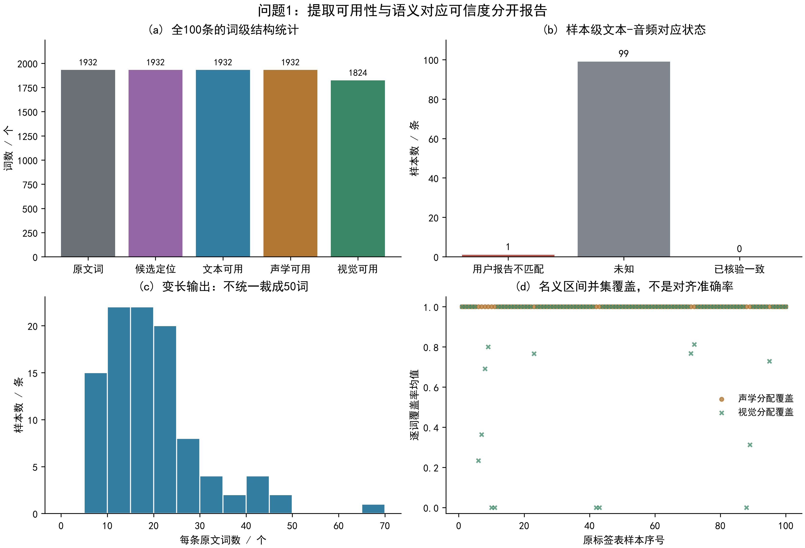

#### 3.4.2 样本有效性：为什么不能压成二值判断

样本有效性另按提取器自身的成功比例分层刻画，而不是压成"有效/无效"二值判断。图3(a)把100条按逐帧人脸检出率分为四层：79条逐帧全检出，6条仅零星缺帧（检出率不低于90%），11条有较大比例缺帧，4条完全无脸。图3(b)把同一比例按升序散点排列，可见检出率在0.29至1.0之间连续分布而非跳变；这正是"一条样本等于一票"会掩盖的信息——4条完全无脸与11条九成以上可用的样本若同记为"有样本"，其视觉信息的实际价值相差极大。图3(c)把原词数与片段时长并列，说明输入是2.26至29.29秒、5至65词的变长序列，本文不做等长截断。图3(d)给出词级构成：1932词中1824词有可用视觉候选，108词无可用候选，自然零为0个，即缺口全部来自提取失败而非真实无信号。

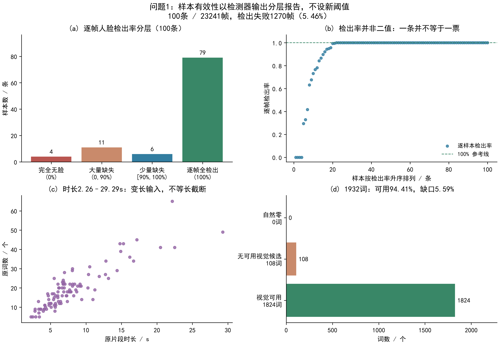

这里有一个反直觉但重要的推论：**"自然零为0"意味着本数据集不存在"画面中确实没有面部动作"的情况**。所有的视觉缺口都是提取器的失败，而不是数据的固有属性。这使"零值"在本数据集中无法承担它在其他场景下可能承担的含义（即"确实无动作"），也解释了第2章第三条假设为何必须成立——把全零行当作真实观测还是当作失败，在本数据集上是一个实质性判断而非形式问题。

#### 3.4.3 特征提取结果的结构

特征提取结果的结构同样需要显式报告，因为"行数"与"词级向量数"是两种不同的量。图4(a)给出每条样本的原词数分布，均值19.3词、中位数18词，范围5至65词，呈右偏。图4(b)列出三模态词级向量的实际维度：文本768维取冻结BERT最后一层，声学25维取eGeMAPSv02低层描述子，视觉25维取OpenFace的AU强度、头姿与视线角；三者均保留工具的实际输出维度，不补零到官方74维与35维。图4(c)并置1932个文本词向量、77261行声学低层观测与23241帧视觉观测：一个词级向量是多个观测行在候选区间上加权聚合的结果，因此行数天然大于词数（声学约为词数的40倍、视觉约为12倍），聚合前后的数值不可互相引用。图4(d)显示内容子词数平均为原词数的1.20倍，100条中无需分块，与3.2节的分块设计一致。

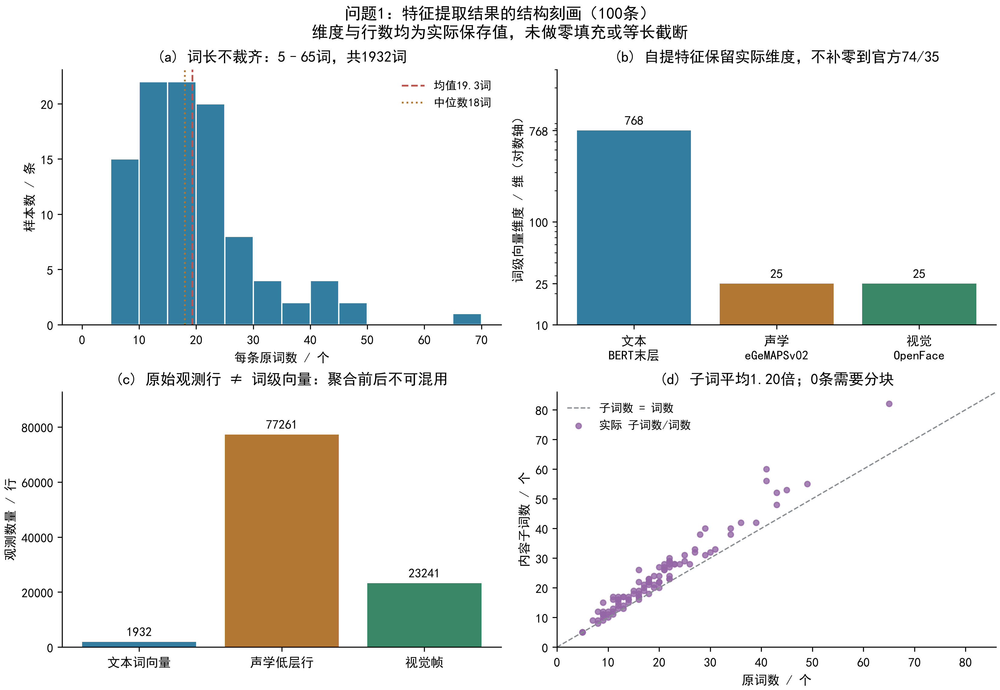

所有词级语义对应仍为unknown。样本级只有1条有听审不匹配反馈，其余99条未知。因无全量人工真实边界，不报告边界MAE、对齐准确率或对齐F1。表3保留全部词级视觉不可用样本，完整100条表见附录A。

表3 词级视觉全部不可用的样本

| 样本ID | 原词数 | 视频总帧数 | 失败帧数 | 可用视觉词数 |
| --- | --- | --- | --- | --- |
| `-NFrJFQijFE$_$1` | 16 | 142 | 142 | 0 |
| `-NFrJFQijFE$_$2` | 18 | 169 | 169 | 0 |
| `-mJ2ud6oKI8$_$1` | 13 | 182 | 182 | 0 |
| `-mJ2ud6oKI8$_$2` | 11 | 171 | 63 | 0 |
| `-ri04Z7vwnc$_$0` | 8 | 67 | 67 | 0 |

其中一条仍有成功帧，但成功帧没有与候选词区间正重叠。因此，词级视觉全不可用与所有帧检测失败不是同一机制。

### 3.5 对齐质量的分层界定

#### 3.5.1 为什么"对齐质量"必须拆成四层

候选对齐的质量之所以必须分层声明，是因为"对齐质量"这四个字在实际使用中同时承载了四种互不蕴含的判断，而本文只对其中一部分拥有真值。如果把它们压成一个数（例如"对齐分数0.83"），读者会自然地把它理解为"对齐准确率约八成"，而这恰恰是本文无法证明的。四层定义如下。

**第一层：时间坐标自洽性。** 只问"我使用的两个时钟彼此接近吗"，不问"音画是否同步"。检验方式是比对容器元数据时长与解码音频时长的偏差：100条样本中最大偏差0.180秒、中位0.100秒。这一量级说明3.1.3节的偏移换算没有引入数量级错误，但它**只证明两个时钟读数接近**，与"人工听审确认了音画同步"是两件事。偏差非零本身就说明两种统计口径存在系统性差异（例如元数据时长可能包含尾部静音）。

**第二层：名义并集覆盖率 $C_{ij}^{m}$。** 定义为候选词区间被可用观测区间覆盖的几何比例，即3.3.3节式(6)。该量回答的是"候选词区间有没有被观测时间覆盖"，**不是**"覆盖到的那段音频真的是这个词的发音"。它本质上是几何覆盖，与语义正确性无关。图5(b)给出逐样本结果：多数样本接近1，少数视觉覆盖降至0.03以下——后者对应3.4.2节中"逐帧人脸检出率很低"的那一批样本。

**第三层：结构合法性与提取可用性。** 只问"这个词有没有结构合法的候选时间和非失败的观测"。1932个原词全部有结构合法的候选时间，全部有声学候选；视觉可用1824词，占94.41%。图5(c)按视觉可用词占比升序排列：86条样本全部词都有可用视觉候选，5条样本的词级视觉全部不可用，其余分布在中间。这一层是工程可用性，与"对齐是否准确"无关。

**第四层：语义对应正确性。** 只问"这个候选区间是否真的是该词（或该情绪片段）的发音/表现区间"。这一层**需要人工词边界真值**，而本题的全量真值不存在（`manual_boundary_error_s`为`null`）。本文能给出的只有3.6节所述的单条听审反馈（100条中1条），因此**已核验词数为0**。

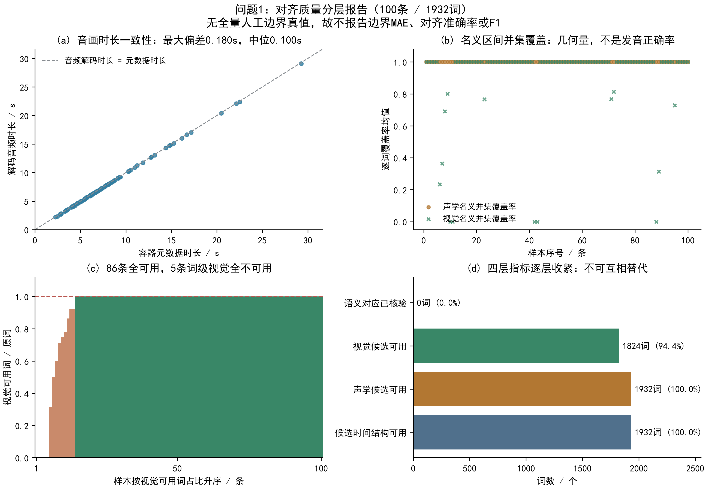

#### 3.5.2 逐层收紧的解读

图5(d)把四层指标并列，直观显示它们按"应然顺序"逐层收紧：1932词结构合法 → 1932词有声学候选 → 1824词有视觉候选 → 0词语义已核验。这个阶梯的性质是**单向蕴含**：下一层成立不能反推上一层，上一层成立也不保证下一层。语义已核验的词必然是视觉可用的，但视觉可用的词未必语义正确。

需要特别提防两种常见的错误借用。第一种是**把覆盖率当准确率**：$C_{ij}^{A}=0.98$ 只说明该词区间几乎被声学观测覆盖，完全不说明聚合到这个词的声学数值来自正确的发音。第二种是**把可用率当一致率**：视觉可用率94.41%描述的是OpenFace是否成功检出人脸，而不是"检出的面部动作是否属于该词对应的说话时刻"。本文在正文中一律使用"覆盖率""可用率"等限定词，不使用"对齐准确率"。

#### 3.5.3 对后续章节的传导限制

由于第四层无真值，本文不报告边界MAE、对齐准确率或对齐F1，这条保守处理直接并且**唯一地**限制了问题3的定位能力上界。到第5章时，模型归因热力图可以标出"模型对哪个候选区间敏感"，该区间的边界由第3层（结构合法性）与第2层（覆盖率）保证不是空的；但该区间的语义归属**未经人工核验**，因此第5章只做三类论断：滑窗级别的相对重要性、跨模态净归因的排序、以及"关键块强于匹配随机块"的显著性比较。任何"模型看的是视频第几秒/哪一帧画面"的表述都被排除，因为那要求第四层成立。

这一限制也可以反过来读作论文的一条设计优点：正是因为第四层缺真值，本文把解释的可信度锚定在**可对照的随机块**上，而不是锚定在"人认可这个解释合理"上。第5章的配对显著性检验正是为此设计的。

### 3.6 案例与独立复算

#### 3.6.1 案例样本的选取规则

展示用样本**不是**按结果好看与否挑选的，而是按两条事前确定的规则各取一例：一是从"三模态候选全部可用"的样本中取一条作为**典型样本**，用于说明正常情况下的数据流动；二是从"存在已知缺陷"的样本中取非理想样本，用于说明缺陷如何被保留而非被修饰。这样做是为了让读者看到的不是最顺利的一条，而是一条顺利的和一条不顺利的并置结果。

**典型样本 `-egA8-b7-3M$_$9`**（图6）含10个原词、489行声学观测、150帧视觉观测，三模态候选均可用。图6把三条信息叠在同一媒体时钟上：真实解码音频波形、按PTS定位的视频帧、以及每个词的候选区间。选择叠加波形与真实帧而非只画区间条，是因为区间条本身无法被独立检验——读者若只看到一根横条，无法判断它对应的是哪段声音、哪一帧画面。给出原始波形与帧后才能让读者自己判断候选区间是否落在合理位置。

此处需要明确图6能证明和不能证明什么。它能证明的是：三条信息确实被放在同一坐标上、候选区间落在这条坐标的合法范围内。它**不能**证明：视觉上重合等价于边界准确；文本向量的范数大小不代表情绪强度；同一词的声学数值与视觉数值描述的是同一个情绪事件。三条限制中最后一条最容易被忽略——三模态在同一区间被聚合，只说明它们共享一个时间窗口，不说明它们表达的是同一件事。

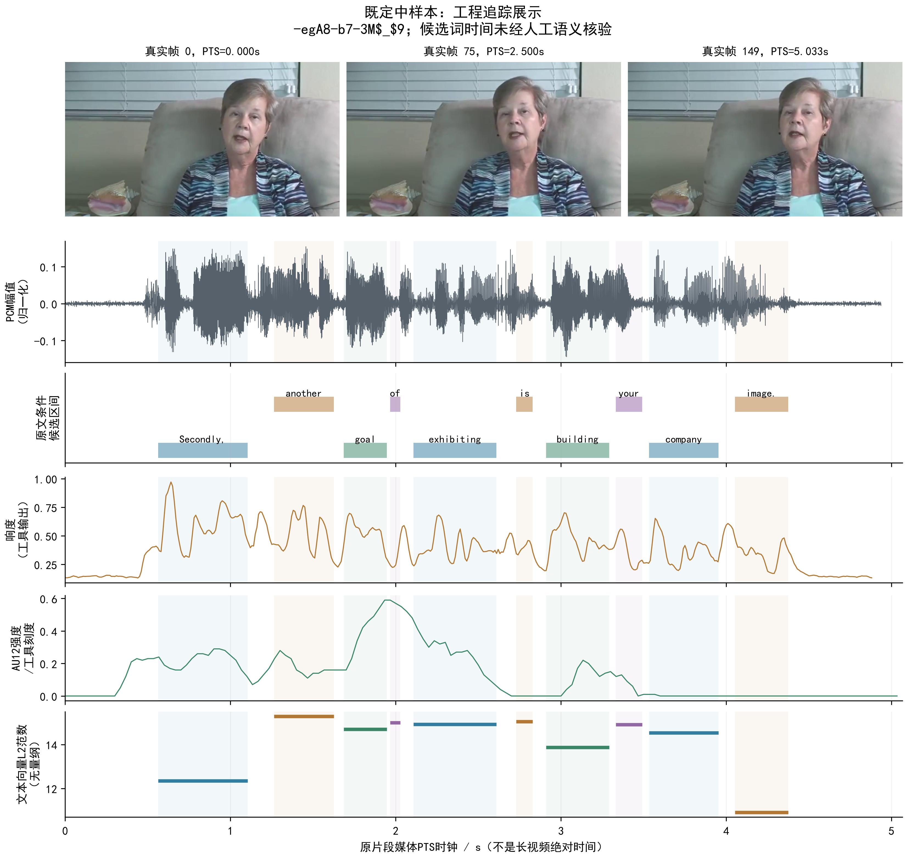

**非理想样本 `-NFrJFQijFE$_$2`。** 该样本的169帧`success`标记全部为0，即视觉提取在整条样本上完全失败；18个原词的视觉候选全部不可用。处理方式是：**保留**该样本、保留其文本与声学表示、把视觉标记为不可用并如实记录。不做的是：把它从样本集里删掉、用零向量填补视觉、或反向修改文本/声学以"补偿"视觉缺失。这一条目直接对应3.4.2节"自然零为0"的推论——若在提取阶段就用零向量填充，本文将永远无法区分"这个样本的视觉真的是零"和"这个样本的视觉根本没提取出来"，而这两种情况在模型行为上完全不同。

**已知反馈样本 `-mJ2ud6oKI8$_$6`。** 该样本原文为"They are all very safe"，而听审反馈显示存在声音不匹配。处理方式同样是保留：保留原文、保留实际音视频、保留该反馈记录，不改写标签、不把音视频清零、不据此删除样本。这是全量100条中唯一一条有听审反馈的样本，它在3.5节第四层的意义是：**100条中已核验者1条、未知者99条**。本文不因为这1条反馈就推断其余99条的问题性质，也不把它外推为某种系统性偏差。

#### 3.6.2 独立复算的范围与容差

为避免"提取脚本自己生成、自己验证"的循环论证，本文对提取产物做了一次**独立的**复算：不调用提取流程本身，而是直接读取保存的产物文件，重新核对六类内容——原始字段、内容哈希、张量形状、区间offset、时间映射（PTS→秒）、以及词级聚合值。

复算结果按模态分列，并统一采用"绝对容差加相对容差"的复合判据，而非要求逐值完全相等：

| 模态 | 最大绝对差 | 判定 |
|---|---:|---|
| 文本 | 0 | 逐值一致 |
| 视觉 | 0 | 逐值一致 |
| 声学 | 0.000244140625 | 在复合容差内通过 |

声学的非零差来自重采样与浮点累积路径（$2^{-12}$量级），属于不同实现下的正常误差，不能表述为"全部逐值一致"。本文的准确表述是：**文本与视觉逐值一致，声学在既定复合容差内通过**。把这三者统一写成"全部一致"是一种夸大，本文刻意避免。

#### 3.6.3 抽样重解码与结论边界

帧级复算另采用抽样方式：对首、中、末三条样本共699帧重新解码，逐帧比对整数PTS与像素哈希，不符数为0。这一结果说明在这三条样本上，保存的帧记录与重新解码的帧在时间与像素上都可以被复现。

该结论的强度必须界定清楚：**699帧的抽样不足以替代全部23241帧的验证**。本文因此把它表述为"抽样重解码未发现不符"，而**不是**"全部帧已逐帧验证通过"。这一区别与3.5节的分层逻辑一致——抽样通过是证据，但不是覆盖全部样本空间的证明。若后续需要把这一层提升为全量结论，只需把同一复算流程扩展到全部帧即可，方法本身无需修改。

综合3.6.1至3.6.3，本节的定位是：**说明"缺陷被保留"与"产物可被独立复现"这两件事各自被验证到什么程度**，而不是宣称提取结果绝对正确。第4、5章的所有结论都建立在这一被限定的基础上。

## 4 问题2 连续局部缺失下的双任务预测

### 4.1 缺失建模与信息隔离

#### 4.1.1 内容域、合成缺失与可观测掩码

问题2与问题1的坐标体系不同：问题1的原词数随样本变化，问题2的官方接口把它固定为50个位置。因此必须先区分三种"位置"，否则"局部缺失"根本无从定义。

令 $P_{it}\in\{0,1\}$ 表示样本 $i$ 第 $t$ 个位置是否属于**原始内容域**——即排除`[CLS]`、`[SEP]`等特殊词元与填充位置后，真正承载内容的那些位置。令 $M_{imt}\in\{0,1\}$ 记录本文**新增的合成缺失**（$M=1$ 表示此处被本次实验主动遮蔽），则实际可观测掩码为

$$
O_{imt}=P_{it}\,(1-M_{imt}).\qquad (7)
$$

式(7)的写法有一个刻意之处：它是**乘法**而非减法。这样做是为了让"原生缺失"与"合成缺失"分离——$P_{it}$ 描述数据本来就有的内容结构，$M_{imt}$ 只描述本次实验制造的损坏。二者不混入同一个量，读者才能判断某处不可观测究竟是数据缺陷还是实验设计。这也是2.2节第三条假设在数学层面的落地：原生A/V全零行按主规则保持 $P=1$（当作真实观测使用），另做一次 $P=0$（视为缺失）的敏感性检查。

#### 4.1.2 块长规则与半整数量化

连续局部缺失要求遮蔽一段**连续**区间，长度为内容位置数的某个比例。对 $L_i\ge2$ 及目标比例 $r\in\{0.2,0.5\}$，块长取

$$
K_i=\max\{1,\ \min[L_i-1,\ \operatorname{round}(rL_i)]\}.\qquad (8)
$$

式(8)包含三层约束，每层都对应一个具体的工程问题：

- **上界 $L_i-1$**：保证至少留下一个可观测位置，否则该模态在样本上彻底不可用，退化成了"整模态缺失"，与本实验要研究的"局部缺失"不是同一命题。
- **下界 $1$**：保证短样本上仍能构造出非空缺失块。
- **$\operatorname{round}$ 采用半整数取偶**：即四舍六入五取偶。选用取偶而非"四舍五入"是为了消除系统性偏置——若一律进位，短样本上实际缺失比例会系统性高于名义比例。

起始、中部、末尾三种位置的块起点分别为

$$
s_i^{\text{start}}=0,\qquad s_i^{\text{middle}}=\left\lfloor \frac{L_i-K_i}{2}\right\rfloor,\qquad s_i^{\text{end}}=L_i-K_i.\qquad (9)
$$

七种模态组合 T、A、V、TA、TV、AV、TAV 与三位置、两比例交叉，构成 $7\times3\times2=42$ 种缺失场景，另加清洁对照共**43场景**。两处口径必须写明：**"清洁"只表示无新增合成缺失**，不代表官方特征中没有原生缺口；**比例是内容位置比例，不是时长比例**——20%的位置在2.26秒的短句与29.29秒的长句上对应的绝对时长完全不同。

验证集有4条 $L_i<2$，无法构造非空缺失块。这4条保留原输入并纳入728条主指标，同时另报724条可构造子集，两种口径并列报告而不择优。此外，同一批样本上跑43个场景**不是43次独立重复实验**：样本完全相同，改变的只是遮蔽位置，因此场景间的差异反映的是同一批数据上的条件变化，不能按独立试验计算显著性。

#### 4.1.3 信息隔离：为什么必须在BERT输入端遮挡

本节是问题2中最关键的一处设计，值得展开说明。

文本缺失有两种实现方式。**输出端遮挡**：先把完整文本过一遍冻结BERT，得到50×768的特征，然后把对应位置置零。**输入端遮挡**：把对应位置的词元换成 `[PAD]` 并关闭其注意力，得到受损文本后再过BERT编码。

本文**采用输入端遮挡**，理由是输出端遮挡存在信息泄露。Transformer的自注意力机制允许任意位置读取任意位置的表示，因此即使第17个位置被置零，该位置的语义信息也可能已经通过双向注意力传播到了第16、18个位置。此时把第17个位置的输出设为零，模型仍然能从未被遮挡的位置间接"看到"被遮蔽内容，从而在缺失条件下表现出**虚假的鲁棒性**——实验看起来稳健，实际上信息从未真正丢失。

输入端遮挡从源头上切断了这条路径：被换为`[PAD]`的词元在编码阶段就不存在，其信息无法进入任何其他位置。代价是每个不同的受损文本都要重新过一次BERT，计算成本显著上升，这也是4.1.4节缓存设计存在的原因。

#### 4.1.4 九份缓存与共享边界

由于输入端遮挡无法复用文本编码，本文为不同用途生成独立缓存，并规定缓存只在"实际编码输入、掩码、样本身份、编码器配置"四者完全相同的情况下才允许复用。具体为：

| 缓存 | 内容 | 份数 |
|---|---|---|
| 训练清洁 | 未受损文本编码 | 1 |
| 训练增强 | 随机抽取的一种局部块受损编码 | 1 |
| 验证清洁 | 未受损文本编码 | 1 |
| 验证文本缺失 | T、TA、TV、TAV 各自在三种位置上的受损编码 | 6 |
| **合计** | | **9** |

验证集共6份文本缺失缓存，是因为七种组合中只有四种含文本（T、TA、TV、TAV），且这三种位置各自需要独立的受损文本编码。A、V、AV三组不含文本，其文本输入与清洁缓存相同，故可直接复用清洁缓存而不新增。

这一绑定关系的作用是**防止"看起来相同"的文本被错误复用**。若仅按文本字符串是否相同来复用，就可能把"清洁文本的编码"用在"该文本被局部遮蔽"的场景上，导致遮蔽无效。缓存设计把这种错误变成不可能。

#### 4.1.5 统计量的冻结与全零行规则

所有跨样本均值与总体标准差**仅由训练集估计**，尺度加 $10^{-6}$ 防止除零；验证集、附件3与附件4只应用这三个固定统计量，绝不重新拟合。这一条与第2章的假设体系一致：如果允许在验证集上重新计算标准化统计，验证结果就带上了对评估数据的拟合，不再是单纯的泛化评价。

A/V原生全零行按主规则保持可观测。该规则的取舍已在2.2节第三条假设备述，4.5节给出"视为缺失"的冻结敏感性结果对比。

### 4.2 预测模型

#### 4.2.1 基线B0：为什么仍需要弱基线

B0采用scikit-learn随机森林分类器与回归器[6]，文本取可观测均值，A/V各取可观测均值、标准差与观测比例，形成988维输入；两者均300棵树，仅用清洁训练集，不搜索超参数。

保留这样一条弱基线的意义在于给"神经模型到底带来了多少增益"提供一个可对照的下限。B0完全不具备时序建模能力（把整个序列压成若干标量），也不具备缺失感知能力，因此它的成绩应当明显低于神经网络；如果两者接近，就说明本文的时序与缺失设计没有产生实质作用。4.5节将给出B0的三分类准确率55.22%与中性召回率5.98%，与代表M3形成明显差距，说明这一基线确实起到了区分作用。

必须说明的口径边界是：**B0与神经模型不是严格单因素比较**。两者的输入维度、损失函数、优化方式都不同，因此两者之差不能被解释为"某一项设计"的贡献。本文只把B0当作一个数量级参照，不基于它做归因。

#### 4.2.2 神经模型的时序编码

神经模型将标准化后的模态特征与 $O$、$M$ 两个掩码通道在特征维拼接，投影到64维，再经两层核宽为3的一维卷积、ReLU激活与0.1的Dropout。三个模态各自独立走这条编码路径，参数不共享。

两个设计细节值得说明。第一，**每层卷积后都屏蔽内容域之外的隐藏值**：由于位置已经被投影到64维，纯粹把输入置零不足以阻止信息在卷积核内传播，必须在每一层重新施加掩码，才能让缺失位置在整条前向路径上都保持"不可见"。第二，**缺失位置不删除**：本文采用掩码而非"删除后重排"的方式，因为删除会改变序列长度与相对位置关系，使同一模型在不同缺失比例下处理的是长度不同的序列，破坏了位置编码的一致性。保留位置、屏蔽数值，才能让"第17个位置缺失"这一事实在整条网络中稳定成立。

编码完成后，在**可观测位置**上做均值池化，得到模态表示 $h_{im}$ 与观测比例 $q_{im}$。使用可观测位置而非全部位置求均值是必要的：若把被遮蔽位置一并计入分母，缺失比例越大池化结果越被稀释，模型将无法区分"这个位置真的观测到零"与"这个位置根本没有观测"。

#### 4.2.3 动态门控融合

对样本 $i$ 的可用模态集合 $\mathcal A_i$（即有可观测位置的模态），门控权重与融合表示为

$$
\alpha_{im}=\frac{\exp g_m(h_{im},q_{im})}{\sum_{k\in\mathcal A_i}\exp g_k(h_{ik},q_{ik})},\qquad z_i=\sum_{m\in\mathcal A_i}\alpha_{im}h_{im}.\qquad (10)
$$

式(10)中有两个关键约定。**第一，门控函数的输入包含观测比例 $q_{im}$**，因此模型不仅能根据模态内容调整权重，还能根据"这个模态还剩多少可用信息"调整权重——这正是"局部缺失"要求的能力。**第二，无观测模态的权重恒为0**，即不参与softmax归一化：若把不可用模态一并纳入分母，它会在自身内容全为屏蔽值时输出一个无意义的打分，从而挤压其他模态的权重。

当全部模态都为空时，模型返回训练集先验而非任意值：类别先验来自负、中、正三类在训练集中的967/758/1670条分布，平均强度为0.165832。这是一个明确规定的回退行为，避免空输入产生不可复现的输出。

门控权重只是模型的**内部权重**，不是因果贡献。这一点必须强调：$\alpha_{im}$ 大只说明在当前样本上前向路径给该模态分配了较大比例，不说明该模态在现实中是情感的决定因素。第5章用完全不同的工具（积分梯度与干预实验）回答贡献问题，正是为了避免把内部权重误读为因果解释。

#### 4.2.4 双任务与损失

分类头输出softmax概率 $\hat p_i$；强度头通过tanh把输出限定在 $[-3,3]$，与标签的取值范围一致：

$$
\hat y_i=3\tanh\!\left(w_y^{\mathsf T}z_i+b_y\right),\qquad \mathcal L_i=\operatorname{CE}(\hat p_i,c_i)+\frac{|\hat y_i-y_i|}{3}.\qquad (11)
$$

损失采用两项直接相加，权重为1与 $1/3$。用 $1/3$ 而非1是因为强度项本身已被归一化到 $[-3,3]$，除以3后其量级与交叉熵处于可比范围，避免回归项在总损失中占据过大的比重。

两个头**独立预测**，本文明确不做三件事：不按回归符号修改分类结果、不事后拟合中性分类阈值、不把两个头的输出强制一致。理由在于：这三个操作都会把"两个头的不一致"这一现象人为抹平，而这一现象本身是有诊断价值的信息——4.5节报告代表M3的双头精确符号不一致率为29.12%，正是这一现象的直接测量。若事后强行对齐，这个诊断量就消失了，也就无法判断双头之间是否存在实质冲突。

需要澄清的是：**输出差异不等于已测得共享梯度冲突**。两个头输出不一致，可能来自任务本身的标签语义（中性类别的强度标签通常非零），而不必然意味着两者的优化目标相互矛盾。本文只报告现象，不进一步断言其成因。

### 4.3 消融与固定选型

#### 4.3.1 消融设计：四个模块逐层叠加

消融的目的是回答"每一个设计模块各自有没有用"。本文按四个模块逐层叠加构造M0至M3，每增加一个模型就多启用一项设计，从而可以观察性能是否随模块增加而单调上升。

表4 模型配置

| 模型 | 合成增强 | 显式O/M通道 | 融合 |
|---|---|---|---|
| M0 | 无 | 固定为0 | 可用模态等权 |
| M1 | 有 | 固定为0 | 可用模态等权 |
| M2 | 有 | 启用 | 可用模态等权 |
| M3 | 有 | 启用 | 学习门控 |

四点必须说明清楚。**第一**，M0与M1仍有掩码，用于保证屏蔽、池化与空输入三处边界行为正确，因此它们不是"完全不知道缺失存在"的模型，而是"知道缺失位置但不会被显式告知缺失模式"的模型。若把这层掩码也去掉，M0会连最基本的空输入回退都无法正确处理，比较就失去意义。

**第二**，M0与M1中所指的"显式O/M通道固定为0"是指：模型的输入特征中仍保留这两个通道的位置与形状，但数值恒为0，不携带信息。这样四个模型的参数量与输入维度保持一致，性能差异才归因于"信息是否被提供"，而不是"网络结构大小不同"。

**第三**，增强清单**事前固定**：每条训练样本以0.5的概率保持清洁，否则从预设的局部块列表中抽取一种，实际得到1671条清洁与1724条增强，且各epoch不重抽。写死清单而非每轮随机重抽，是为了让不同模型、不同种子面对完全相同的训练分布——如果每轮重抽，M0与M1的性能差异中就会混入随机抽样的差异。

**第四**，优化设置固定为Adam、学习率0.001、batch32、最多30轮、patience5，按清洁验证上的双任务联合损失早停，BERT全程冻结。用**清洁**验证损失而非缺失场景损失作早停依据，是为了防止早停标准本身被缺失实验影响，从而让后续43场景的结果成为对"按清洁性选择的模型"的独立评价。

#### 4.3.2 选型规则与"不挑最好"约束

四个模型的初始种子统一为20260924。选型分两步：**先过门槛**，候选需满足清洁Macro-F1不低于M0减0.02、清洁MAE不高于M0加0.05；**再排序**，按43场景平均Macro-F1降序、平均MAE升序，并列时按预先固定的优先序决定。

这一规则的三点边界。**其一**，它**不是官方评分公式**，是本文自行设定的工程判据；**其二**，门槛的作用是排除"为鲁棒性牺牲清洁性能过多"的候选，而不是筛选精度最优者；**其三**，排序使用43场景等权平均而非某些特定场景，避免针对少数场景过度优化。

选定的M3补充两个种子20260925、20260926，使正式选型的神经训练共**6次**。补充种子前，本文先把初始种子的检查点固定为**代表模型**，后续所有报告（含4.4节的表6、第5章的全部解释）都以该检查点为准，**不挑最好种子、不做多种子集成、不以均值替换单种子结果**。这一约束是本文在报告纪律上最重要的一条：一旦允许"从三个种子里挑一个最好看的"，前面所有关于"稳健性"的结论都会失去意义，因为挑选行为本身就是对评估数据的使用。

后续开发对照另见4.6节与4.9节，两者的训练次数分别单独记账（终检前开发25次、终检后探索9次），不并入本轮正式选型的6次。

### 4.4 验证结果与随机性

#### 4.4.1 评价口径

表5以全部728条验证样本评价，43场景为逐场景等权平均。三项指标的度量方式如下：Accuracy为分类正确率；Macro-F1对负、中、正三类的F1**等权**平均（因此少数类与多数类权重相同，这也解释了它为何显著低于Weighted-F1）；MAE为强度预测的绝对误差均值。

采用Macro-F1而非Accuracy作为主要选型指标，是因为验证集三类样本数分别为206、184、338，存在明显的类别不平衡。若只看Accuracy，模型只要偏向多数类（正向）就能获得较高分数，而中性类几乎完全识别不出来的模型仍可能"看起来不错"。B0的表现恰好印证了这一点：4.5节将给出B0的三分类Accuracy为55.22%、而中性召回率仅5.98%。

#### 4.4.2 基线与消融结果

表5 初始种子的基线与消融结果

| 模型 | 清洁准确率 | 清洁F1 | 清洁MAE | 43场景F1 | 43场景MAE |
| --- | --- | --- | --- | --- | --- |
| B0 | 0.5522 | 0.4244 | 0.6372 | 0.4256 | 0.6534 |
| M0 | 0.6332 | 0.5772 | 0.6115 | 0.5578 | 0.6357 |
| M1 | 0.6346 | 0.5758 | 0.6146 | 0.5560 | 0.6379 |
| M2 | 0.6319 | 0.5652 | 0.5931 | 0.5485 | 0.6184 |
| M3 | 0.6277 | 0.6078 | 0.5875 | 0.5793 | 0.6169 |

代表M3清洁Accuracy为62.77%，即457/728条正确；Macro-F1为0.6078、MAE为0.5875、Weighted-F1为0.6297、Pearson为0.6553。

这里需要直白地指出两点"不好看但必须报告"的结果。**第一，Accuracy并非最高**：M1为63.46%，高于代表M3的62.77%。这与"模块越多越好"的朴素预期相反。**第二，Macro-F1没有随模块逐层上升**：M0为0.5578，M1为0.5560，M2为0.5485，M3（初始种子）为0.5793——中间出现回落。因此本文不能概括为"全部模块逐项有效"，只能说最终配置在综合性判据下被选中。

这一现象的原因可以解释：O/M通道与门控提供了额外信息与自由度，同时也增加了在小规模验证集上过拟合的风险；M1相对M0的微小回落（0.0018）远小于种子间波动量级（4.4.3节给出标准差0.0214），因此不能解读为"增强模块有害"，只能说"这四项设计没有体现出单调的边际收益"。本文采取的报告方式是：如实给出全部四个数字，不做取舍。

#### 4.4.3 种子随机性与统计口径

表6 M3三种子结果

| M3种子 | 清洁Macro-F1 | 清洁MAE | 43场景平均Macro-F1 | 43场景平均MAE |
| --- | --- | --- | --- | --- |
| 20260924 | 0.6078 | 0.5875 | 0.5793 | 0.6169 |
| 20260925 | 0.5606 | 0.5954 | 0.5547 | 0.6165 |
| 20260926 | 0.5485 | 0.5880 | 0.5365 | 0.6091 |
| 均值±样本标准差 | 0.5723±0.0313 | 0.5903±0.0044 | 0.5568±0.0214 | 0.6142±0.0044 |

M3的43场景Macro-F1为0.5568±0.0214，该均值**数值上接近M0的单种子0.5578**，初始门控在各场景上的优势没有稳定保持。这一点是本文最需要坦率陈述的负结果：M3在初始种子上的43场景Macro-F1为0.5793，明显高于M0的0.5578，但补充两个种子后均值回落到0.5568——说明初始种子的优势有相当部分来自种子随机性，而非结构优势。

关于"±"号的解读有三条严格限制：

**第一，样本标准差不是置信区间。** 三个种子的标准差描述的是"换一个随机种子结果会波动多大"，它与"模型真实泛化性能的置信区间"是两个不同的统计对象，不能混用。

**第二，M0至M2只有单种子，无法作严格配对显著性检验。** 单点与三点均值之间不存在配对结构，本文不报告p值，也不使用"显著提升"这类措辞。

**第三，n=3本身不足以支撑强推断。** 三种子均值只能用于判断"某个差异是否大于种子波动量级"，不能用于宣称"某个设计在总体上更优"。本文把这条限制贯彻到全部后续章节：凡是跨种子的比较，一律同时给出均值与标准差，并在差异小于标准差时明确标注"不能据此声称更优"。

图7展示比较与波动。

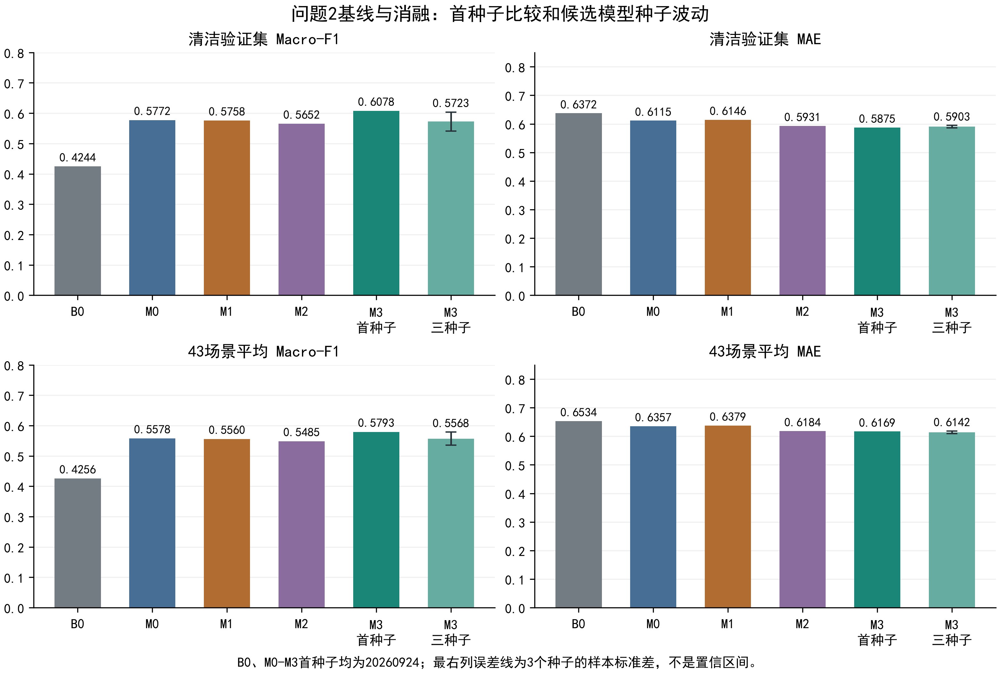

#### 4.4.4 雷达图的口径与禁用方式

图8以雷达图汇总同一组消融结果，用于同时观察清洁验证与43场景下的分类和回归四个方向。这里有两处刻意设计以避免误读。

**其一，MAE轴统一变换为 $1/(1+\mathrm{MAE})$。** MAE越低越好，而雷达图的"越靠外越好"是默认直觉；若直接把MAE画在轴上，方向会与其他三项相反，读者极易读反。做 $1/(1+\cdot)$ 变换后四个轴方向一致。必须强调：**这不是准确率**，只是方向对齐用的单调变换，数值本身没有"百分比"含义。

**其二，四个轴均取完整 $[0,1]$ 区间，不按候选极值放大差异。** 若按数据范围自适应缩放，四个模型间0.001量级的差异会在视觉上被放大到看起来很大，从而制造虚假的显著性。固定为 $[0,1]$ 后，读者看到的差异幅度与实际量级一致。

图中同时单列M3的三个种子，目的是**防止把种子均值误当作第六个模型**——三个种子是同一个配置的三次独立训练，不是三个新方法。该图不用于以面积作综合排名，也不支持"M3在所有指标上均最优"的结论：M1的清洁Accuracy为0.6346，确实高于代表M3的0.6277，这一点在图中清晰可见。

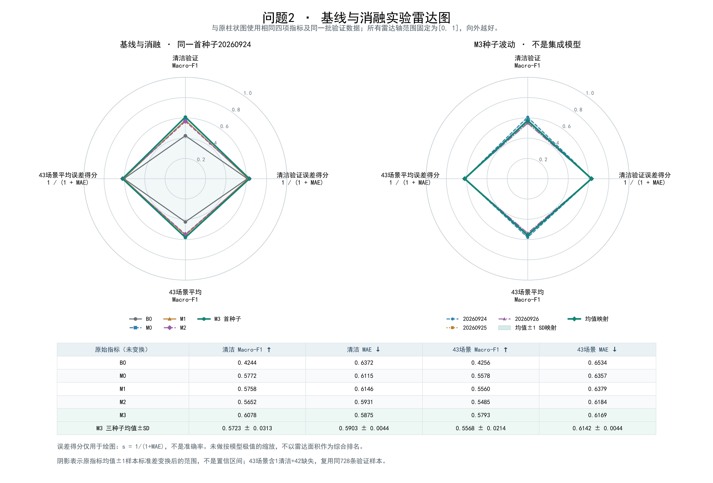

### 4.5 缺失规律与误差分析

#### 4.5.1 控制组与混淆结构

完整模态（无缺失控制组）是后续所有缺失场景的比较基准。图9左侧给出代表M3在该条件下的三分类混淆矩阵，右侧把三种子与基线B0的四项清洁指标并列。

728条验证样本中真值负、中、正分别为206、184、338条；代表M3的正确数为457条，Accuracy为62.77%。混淆矩阵中最值得注意的一行是**真值中性**：其召回率仅47.28%，其中38.04%被判为积极。也就是说，中性样本中超过三分之一被推向了正向，这一单行错误贡献了相当比例的总体误差——中性类共184条，被判错约97条，而全部错误为271条，仅此一行就占了三成以上。

B0的中性召回率仅5.98%，三分类Accuracy为55.22%，仅略高于随机猜测的33.33%。两者并置的解读是：神经网络相对随机森林的提升，主要不是来自"整体判断更准"，而是来自**中性类从几乎完全识别不出来（5.98%）到勉强可辨识（47.28%）**。这一观察对后续所有改进方向都有约束意义——任何声称"提升精度"的方案，都必须回答它对中性类的召回做了什么。

需注意右图的三个M3柱是三次独立训练而非集成，其均值口径与4.4节表6一致。

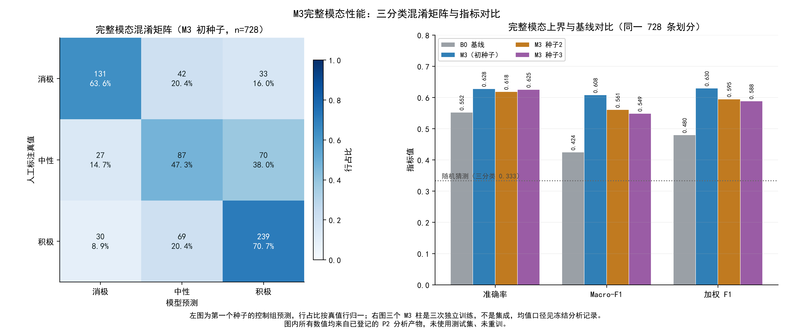

#### 4.5.2 缺失场景的总体规律

三种子逐场景均值中，单T缺失Macro-F1为0.5463，单A、V为0.5716、0.5723——即缺失文本的损失明显大于缺失音频或视觉。20%增至50%时，平均Macro-F1从0.5606降至0.5524，MAE从0.6037升至0.6259。

图10呈现位置、比例与模态组合的交互影响。

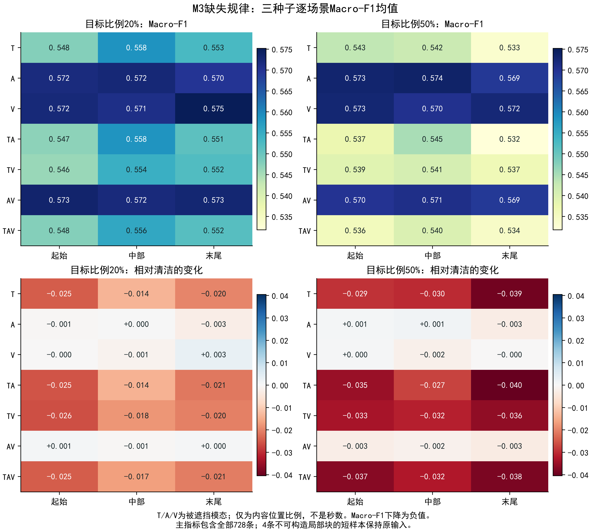

#### 4.5.3 八档比例扩展：为什么需要内插检查

上述网格只覆盖20%与50%两个比例档位，无法看清"性能随缺失比例如何变化"的形状。为此本文在同一实现下把档位扩展到10%、20%、30%、40%、50%、60%、70%、80%共八档，位置与模态组合不变，构成**168个场景×3种子=504**条逐场景结果（含清洁对照共169个场景）。

这一扩展的合法性问题必须先解决：新增的六个档位是否属于"对未测档位的外推"？本文的做法是把扩展结果与冻结的43场景结果在重叠档位上逐值比对——20%与50%两档的129项比对**最大绝对差为0**，说明扩展使用的是完全相同的实现（同一训练统计、同一BERT输入路径、同一组固定种子检查点）。因此这六个新档位可以被视为**同一实现的内插检查**，而非对未测档位的外推。

关键约束是：**该扩展不新增任何训练**。它只复用已有模型做推理，因此不改变4.3节记的6次正式选型训练与4.6节记的25次开发拟合的账目。这一区分在比赛评审中很重要——推理次数与训练次数的性质完全不同，不能混为一谈。

图11给出位置取平均后的结果，柱为逐场景均值、折线仅连接T、TAV、A、V四组以示趋势。

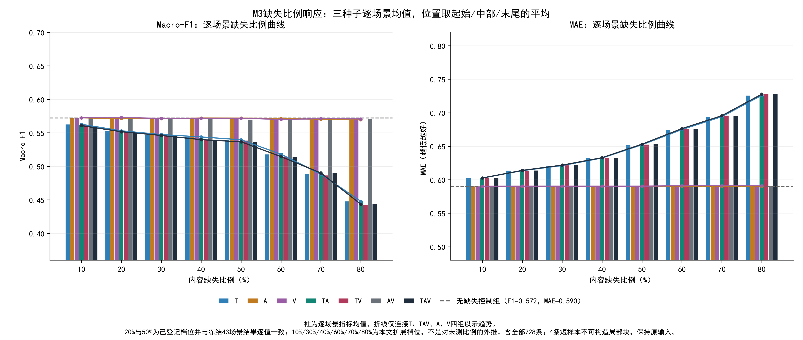

#### 4.5.4 核心发现：是否含文本是主要分界

扩展结果揭示的规律比原网格更清晰，也是本章最重要的实证结论：**是否包含文本通道，而非缺失多少，是主要分界**。

只看对音频与视觉的遮蔽（A、V、AV三组），Macro-F1从10%到80%几乎不变，80%时相对控制组的落差仅**0.0016至0.0028**；而只要文本通道被遮蔽（T、TA、TV、TAV四组），80%时的落差就达到**0.1236至0.1301**，约为前者的**五十倍**。不含文本的组合在80%比例下仍保持0.57左右，含文本的组合则降到0.44至0.45。

MAE呈现镜像规律：含文本组在80%时上升约0.13，不含文本组几乎不动。

图12把同一批数据改画为相对控制组的净变化，并按起始、中部、末尾三种位置分别成线。

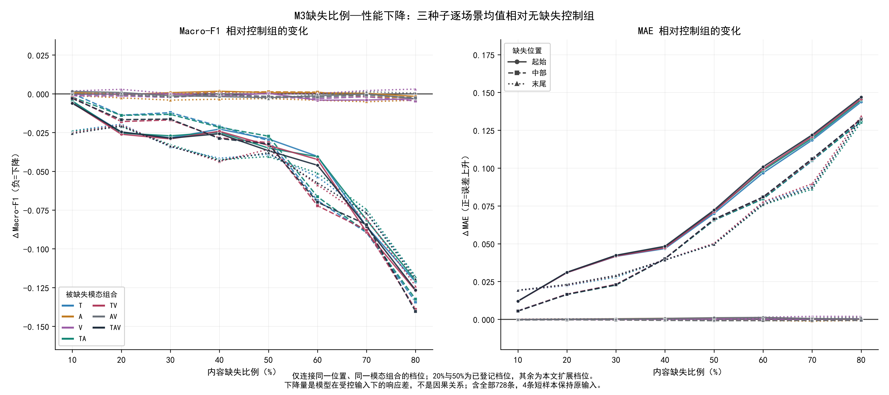

这一结果有三层解读，必须依次说清，否则极易被过度引申。

**第一层（可直接陈述的事实）**：在本模型的表示中，文本分支是承载判别信息的主要通道；遮蔽音频或视觉对分类结果影响很小。

**第二层（需要限定的推论）**：这说明模型对该数据集的**特征表示**高度依赖文本。它**不证明**现实情感不依赖声音或画面。一个关键的解释是：本文使用的A与V特征分别为25维与74维的低层描述子（韵律统计与面部动作单元），而文本是768维的预训练语义表示——两者承载的信息密度本身不在一个量级。因此"文本更重要"这一现象，至少有相当部分来自**特征表示的不对等**，而不是模态本身的信息量差异。4.9节的LoRA实验（让文本参数可适配）与跨模态注意力实验（让音视频能被文本查询）正是为检验这一解释而设。

**第三层（明确的边界）**：由于A/V缺失在80%遮挡下几乎无影响，本文无法通过本实验分辨"音频与视觉真的信息量少"与"音频与视觉特征提取不足"。要区分这两者，需要更高层的音视频表示（例如预训练语音/视觉编码器），本文未做。

#### 4.5.5 位置效应与模态效应的大小对比

图13把模态类型与缺失位置分开比较。左图按模态组合分组：含文本的T、TA、TV、TAV四条曲线几乎重合，不含文本的A、V、AV三条曲线贴住控制组线，两者形成两条明显分离的带；右图比较20%与50%两档下三种位置的并列柱。

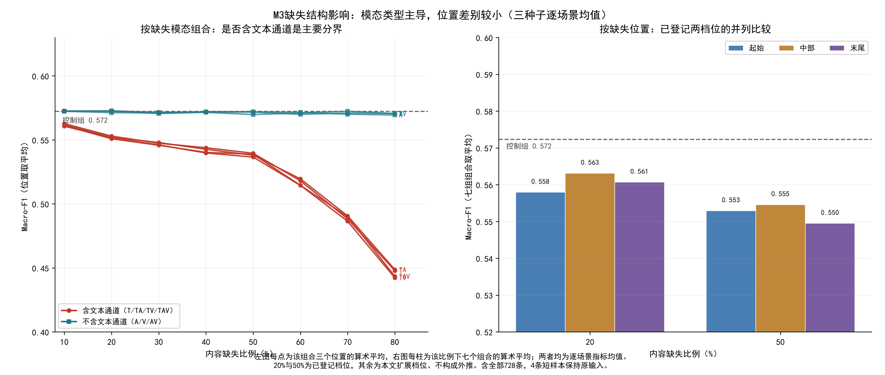

位置的影响明显小于模态类型：20%时起始、中部、末尾分别为0.5580、0.5631、0.5607，50%时为0.5529、0.5546、0.5495，三者差距都在**0.006以内**；而模态类型造成的差距在80%时超过**0.12**，相差约二十倍。

这个对比的实践含义是：对这类模型而言，"缺失发生在序列的哪个位置"远不如"缺失发生在哪个模态"重要。粗看有些反直觉——通常认为句中部的缺失应当比句首更严重——但结合4.5.4节的发现就不难理解：既然分类判别主要依赖文本整体语义而非某个局部位置，那么文本内部的缺失位置自然影响有限；真正决定性能的是"文本这条通道还在不在"。

这一结论有其限度：它成立的前提是特征为低层描述子加预训练文本的**不对等组合**。若换用对等的模态编码器，位置效应是否仍然次要，本文无法回答。

#### 4.5.6 "缺失长度"口径：取整的影响

"缺失长度"在本实验中由遮挡规则的取整方式定义，需要专门说明口径。规则为

$$
\text{count}=\max\!\left(1,\ \min\!\left(n-1,\ \left\lfloor 0.5+\rho n\right\rfloor\right)\right),\qquad n\in[5,50],\qquad (12)
$$

其中 $n$ 为该样本的有效槽位数（本文取5至50），$\rho$ 为目标比例。当 $n$ 较小时，取整与下界1的共同作用会使真实遮挡长度偏离名义比例：目标10%在5至9槽的短样本上平均只遮挡约1个槽位，实际比例反而高于10%。

图14左侧按样本槽数分组展示真实遮挡长度与"严格按比例"参考线的偏离：长样本基本贴合参考线，短样本则系统性偏低；右侧把含文本缺失场景的全部预测按真实遮挡槽位数分箱统计准确率。

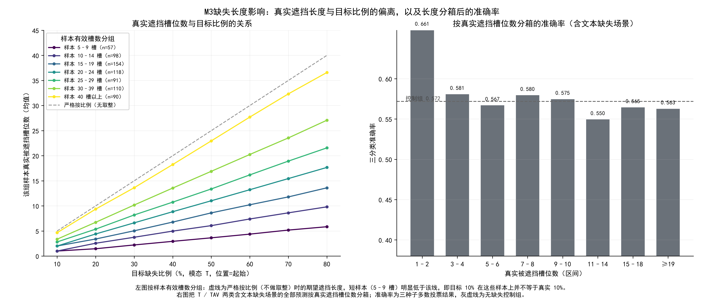

该图说明：本文报告的"10%缺失"在短样本上**并不严格等于10%**，这是必须在正文中声明的口径边界。若读者要把本表的"10%"与其他实现的"10%"直接比较，必须先确认两者的取整规则一致。这一取整方式可能在短句上产生相同块长，也是4.5.7节所述"21对固定组合中仅17对F1严格下降"的原因之一——当不同比例在短样本上被取整到同一块长时，两个名义不同的场景实际上是同一个实验，性能自然不一定变化。

#### 4.5.7 单调性的边界与极端场景

前面的现象只表示模型对给定表示的敏感性，不证明现实情感不依赖声音或画面。代表M3的21对固定组合中，**仅17对F1严格下降、17对MAE上升**，不是逐场景必然单调。这一数字的意义在于：它给出了"缺失越大性能越差"这一直觉的反例数量——21对中有4对不下降，说明在中等比例区间内，遮蔽某些内容有时会带来微小增益（可能源于遮蔽本身起到了正则化作用）。

网格内最低Macro-F1为TAV_end_50的0.5256，最高MAE为TAV_start_50的0.6790——**两个最差场景不同**。这说明分类最优与回归最优并不重合，进一步支持了双任务独立预测的设计选择：若强行用回归结果约束分类，两个方向上的最差场景就无法被分别观察。

图15给出清洁及网格内分类最差混淆矩阵。

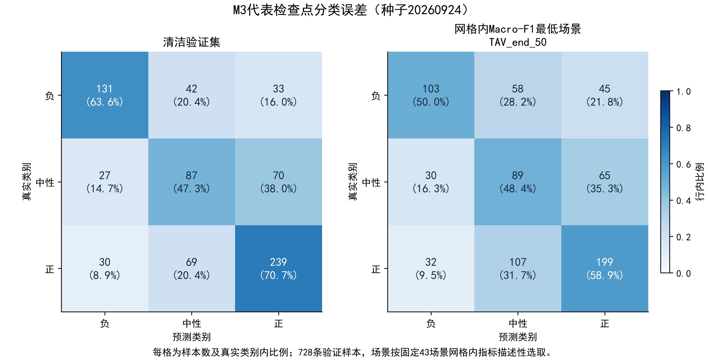

回归方面存在极端值向中间收缩及部分大误差。代表M3清洁双头精确符号不一致率为29.12%，其中包括中性分类与通常非零的连续回归，**不可直接解释为错误率**——如前所述，两个头回答的是不同问题，符号偶然不一致是正常的。扩展扫描中最不利的组合为TAV_middle_80，Macro-F1相对控制组下降0.1405、MAE上升0.1324。

#### 4.5.8 全零行规则的敏感性检查

把原生全零A/V行视为缺失（而非可观测零值）的冻结敏感性检查结果如下：三种子43场景Macro-F1由0.556845变为0.556412，MAE由0.614208变为0.614687。

总体差异很小（Macro-F1变化约0.0004），但**个别种子与场景最多有10/728条分类改变，最大概率变化0.243994、强度变化0.296202**。因此不能称"全零行没有影响"。

正确的表述是：该规则对**总体平均指标**影响可忽略，但对**个别样本的预测**影响可达类别翻转级别。这一区别提示了一个重要的方法论要点——总体指标稳定不等于逐样本行为稳定。这也正是2.2节第三条假设采用"主规则+敏感性检查"双轨报告的原因：主规则不需要额外假设，敏感性检查则披露该假设的实际影响范围。两种规则的结果均在正文报告，且**不事后反选**更有利的那一种。

### 4.6 参数与损失敏感性分析

#### 4.6.1 目的与边界

为检验现有配置的可改进空间，本文在正式选型之后依次开展参数、选权规则、模态和类别损失对照。**已测试的设置均未形成足以替换正式模型的稳定综合收益**，因此保留原M3及清洁验证联合损失最低的选权规则。

这一节的性质必须在一开始就界定清楚：以下全部是**开发阶段的内部验证分析，不是独立测试结论**，也不将后续试验追述为初始选型的一部分。也就是说，本节的结果不能用来声称"我们探索了这些方案并证明它们无效"，只能声称"在本文的验证集、预算与配置下，这些改动没有带来可替换原模型的收益"。

各项对照使用同一训练集、728条验证集及三个固定种子20260924、20260925、20260926，沿用BERT输入端遮挡缓存、训练统计和增强清单。参数试验分别只将weight_decay由0改为0.0001、dropout由0.1改为0.2、学习率由0.001改为0.0003；选权试验固定模型和训练损失，在同一轨迹内比较三种规则。文本单模态与类别加权分别另行训练，**不叠加**上述改动。各轮在执行前分别登记范围，跨轮研究方向则由已有诊断逐步形成，**不属于一次性预注册的完整搜索**——这一点必须坦白，因为它意味着本节无法给出"搜索空间已穷尽"的保证。

#### 4.6.2 训练记账

第一组对照共新增**19次**真实数据拟合：参数轮10次（含原配置复现1次），同轨迹选权3次，文本单模态3次，类别加权3次。随后文本注意力池化和增强用量对照各新增3次，**终检前开发累计25次**，另于正式选型6次记账。

三处记账细节需要澄清，否则容易把拟合次数算错：

- **原配置复现不作为第四个独立种子**，它只是确认框架可重现；
- **选权的三种规则共享3条轨迹，并非9次拟合**——三种规则只是在同一条训练轨迹上按不同标准挑轮次，前向与反向的次数没有增加；
- 表7登记Q2全部已实施实验，最后三行是终检后新增的9次独立优化拟合，详见4.9节。

#### 4.6.3 全量实验登记

表7 Q2全部实验登记表

| 实验组 | 唯一改动或目标 | 拟合次数 | 清洁验证 Accuracy / Macro-F1 / MAE | 43场景验证 Accuracy / Macro-F1 / MAE | 结论 |
| --- | --- | --- | --- | --- | --- |
| B0 | 随机森林分类/回归基线；无训练增强 | 1组 | 55.22% / 0.4244 / 0.6372 | 54.69% / 0.4256 / 0.6534 | 仅作基线，不参与神经选型 |
| M0 | 无训练增强；可用模态等权 | 1次 | 63.32% / 0.5772 / 0.6115 | 61.05% / 0.5578 / 0.6357 | 初始神经基线 |
| M1 | 有训练增强；显式缺失通道关闭；等权 | 1次 | 63.46% / 0.5758 / 0.6146 | 61.42% / 0.5560 / 0.6379 | 满足预登记门槛 |
| M2 | 有训练增强；显式缺失通道开启；等权 | 1次 | 63.19% / 0.5652 / 0.5931 | 61.18% / 0.5485 / 0.6184 | 满足预登记门槛 |
| M3 | 有训练增强；显式缺失通道开启；学习门控 | 1次 | 62.77% / 0.6078 / 0.5875 | 59.53% / 0.5793 / 0.6169 | 按预登记规则选为正式模型 |
| M3补充种子 | M3；补充随机种子20260925、20260926 | 2次 | 62.16% / 0.5546 / 0.5917 | 60.64% / 0.5456 / 0.6128 | 仅报告随机波动，不改代表权重 |
| 原配置复现 | 原M3配置复现；检查训练轨迹与结果一致性 | 1次 | 62.77% / 0.6078 / 0.5875 | 59.53% / 0.5793 / 0.6169 | 复现校验；不作为第四个独立种子 |
| 联合损失最低选权 | 同一3条训练轨迹按验证联合损失最低选权 | 3条共享轨迹 | 62.36% / 0.5723 / 0.5903 | 60.27% / 0.5568 / 0.6142 | 正式选权规则保留 |
| 按Accuracy选权 | 同一3条训练轨迹按清洁Accuracy最高选权 | 同上 | 62.59% / 0.5910 / 0.6376 | 59.91% / 0.5686 / 0.6585 | 未替换；MAE与43场景Accuracy变差 |
| 按Macro-F1选权 | 同一3条训练轨迹按清洁Macro-F1最高选权 | 同上 | 62.59% / 0.5910 / 0.6376 | 59.91% / 0.5686 / 0.6585 | 未替换；与Accuracy规则选中同轮 |
| 权重衰减 | weight_decay: 0 → 0.0001 | 3次 | 61.95% / 0.5346 / 0.5947 | 59.79% / 0.5185 / 0.6189 | 平均分类表现下降 |
| Dropout | dropout: 0.1 → 0.2 | 3次 | 61.54% / 0.5103 / 0.5983 | 60.04% / 0.5003 / 0.6213 | 平均分类表现下降 |
| 学习率 | learning_rate: 0.001 → 0.0003 | 3次 | 62.68% / 0.5889 / 0.6000 | 60.30% / 0.5692 / 0.6222 | 未形成稳定综合收益 |
| 文本单模态 | 移除音频与视觉分支，重新训练文本模型 | 3次 | 61.86% / 0.5223 / 0.6110 | 59.78% / 0.5029 / 0.6348 | 总体及中性识别未改善 |
| 温和类别加权 | 仅训练CE项按类别频率加权 | 3次 | 62.18% / 0.5749 / 0.6136 | 60.48% / 0.5646 / 0.6339 | 中性召回小幅变化，MAE变差 |
| 文本注意力池化 | 文本均值池化 → 64参数掩码注意力池化 | 3次 | 62.27% / 0.5551 / 0.5982 | 60.59% / 0.5421 / 0.6211 | 清洁F1与中性召回下降，未采用 |
| 增强用量减半 | 固定增强样本1724条 → 862条；不扩样、不重采样 | 3次 | 61.31% / 0.5152 / 0.6053 | 59.88% / 0.5062 / 0.6283 | 清洁分类与43场景综合表现下降 |
| 跨模态注意力 | 池化前共享双头跨模态注意力；新增16963参数 | 3次 | 61.40% / 0.5300 / 0.5960 | 59.59% / 0.5184 / 0.6198 | 分类下降；整模态MAE改善；未采用 |
| 整模态随机失活 | 训练样本以0.10概率移除一个可用模态 | 3次 | 61.36% / 0.5253 / 0.5960 | 59.39% / 0.5099 / 0.6202 | 整模态压力表现改善；清洁下降；未采用 |
| LoRA | BERT末4层Q/V；秩4；新增49152参数 | 3次 | 62.32% / 0.5696 / 0.5911 | 60.33% / 0.5563 / 0.6144 | 总体近似持平；未达门槛；未采用 |

表7的B0、M0—M3及原配置复现报告单种子结果，M3补充种子报告两个新增种子的均值，其余对照报告三个固定种子的均值。B0的1组指分类与回归两个随机森林模型，另列于神经网络拟合计数之外；**正式选型6次、终检前开发25次和终检后探索9次，合计40次神经网络拟合**，三种选权规则只计3条共享轨迹。

表中汇总全部训练、选型与选权对照，不以最好种子替代均值；不新增训练的全零行敏感性及误差诊断见4.5节，冻结模型测试终检见4.8节，未实施的类别扩充等建议不记为完成实验。这三句分别对应三条报告纪律：不用最优种子代替全部、不把推理算作训练、不把设想算作实验。

表8和表9仅汇总第一组对照，均为三种子均值；表8的变化为相对同种子原M3的平均差，单位为百分点。原M3均值62.36%与正式代表模型单种子62.77%口径不同，两者不可混用。

表8 参数与损失对照的清洁验证表现

| 方案 | 准确率/% | 变化/百分点 | Macro-F1 | MAE |
| --- | --- | --- | --- | --- |
| 原M3 | 62.36 | +0.00 | 0.5723 | 0.5903 |
| 权重衰减0.0001 | 61.95 | -0.41 | 0.5346 | 0.5947 |
| Dropout 0.2 | 61.54 | -0.82 | 0.5103 | 0.5983 |
| 学习率0.0003 | 62.68 | +0.32 | 0.5889 | 0.6000 |
| 按Accuracy选权 | 62.59 | +0.23 | 0.5910 | 0.6376 |
| 按Macro-F1选权 | 62.59 | +0.23 | 0.5910 | 0.6376 |
| 文本单模态 | 61.86 | -0.50 | 0.5223 | 0.6110 |
| 温和类别加权 | 62.18 | -0.18 | 0.5749 | 0.6136 |

表9 参数与损失对照的43场景平均表现

| 方案 | 准确率/% | Macro-F1 | MAE |
| --- | --- | --- | --- |
| 原M3 | 60.27 | 0.5568 | 0.6142 |
| 权重衰减0.0001 | 59.79 | 0.5185 | 0.6189 |
| Dropout 0.2 | 60.04 | 0.5003 | 0.6213 |
| 学习率0.0003 | 60.30 | 0.5692 | 0.6222 |
| 按Accuracy选权 | 59.91 | 0.5686 | 0.6585 |
| 按Macro-F1选权 | 59.91 | 0.5686 | 0.6585 |
| 文本单模态 | 59.78 | 0.5029 | 0.6348 |
| 温和类别加权 | 60.48 | 0.5646 | 0.6339 |

43场景包含清洁对照，同一批验证样本上的各场景不是独立重复试验。文本模型在该网格中**只有7种不同的文本输入**：清洁输入重复19次，其余6种各重复4次。因此表9的文本行仅为统一网格下的描述性汇总，**不能视为43种独立的文本鲁棒性证据**。两表的MAE越低越好，准确率和Macro-F1越高越好。

#### 4.6.4 逐项结果与取舍

**参数与选权。** 本次幅度的权重衰减和Dropout均未改善平均分类表现。较小学习率使准确率提高约0.32个百分点，但仅一个种子提高、一个持平、一个下降，且平均MAE由0.5903升至0.6000——即分类略好而回归变差，不构成综合改善。

按Accuracy或Macro-F1选权在本次三个种子中**选中了相同的轮次**，准确率均值仅提高约0.23个百分点，清洁MAE却升至0.6376，43场景准确率也从60.27%降至59.91%。与此同时，43场景Macro-F1有所提高，**故不能笼统声称所有鲁棒性指标均下降**——这正是需要分指标报告的原因。选权比较仅覆盖原联合损失早停前的共同轨迹，不推断更换早停机制或继续训练后的结果。

**融合与中性识别。** 文本单模态为**真正重新训练**的文本CNN和双头，不是在三模态模型推理时临时屏蔽音视频。其准确率均值为61.86%，低于三模态62.36%；中性召回率由30.07%降至13.59%。首种子虽然总体多正确1条，中性正确数却从87降至43，表明**总体准确率可能掩盖类别间取舍**。

一个重要的口径限制：三模态与文本模型参数量分别为131274和74308，移除分支还改变了Dropout随机数消耗顺序，因此**这不是参数量匹配后的纯模态因果比较**。现有结果只支持"不支持为提分直接删除音视频"，不支持"音视频的贡献可以被去除"。

已有双头诊断也不支持直接用回归接近零覆盖中性分类；**输出差异不等于已测得共享梯度冲突**。

**类别加权与损失敏感性。** 按训练类别频率 $p_c$ 定义

$$
w_c=\frac{p_c^{-1/2}}{\sum_k \sqrt{p_k}}\,,\qquad (w_{\text{neg}},w_{\text{neu}},w_{\text{pos}})=(1.0973,\ 1.2394,\ 0.8350).\qquad (13)
$$

训练损失改为

$$
\mathcal L^{\text{w}}=\frac{1}{B}\sum_{i=1}^{B}w_{c_i}\operatorname{CE}_i+\frac{\operatorname{MAE}}{3},\qquad (14)
$$

其中 $B$ 为批样本数，**不按批内权重和归一**；验证和早停仍使用原未加权联合损失。需要说明的是：$w_c$ 采用幂次 $-1/2$ 而非 $-1$，是为了在缓解不平衡的同时不把少数类的权重抬得过高。全训练集平均样本权重为1，但**这不意味着CE数值或梯度尺度不变**——平均为1只是加权后的期望，逐批的实际加权和仍会波动，梯度尺度随之改变。

加权后中性召回率仅由30.07%升至30.43%，精确率却由49.23%降至45.51%；清洁及43场景平均MAE均增大。首种子达到63.32%，对应选中权重确已保存，但另外两个种子准确率下降，三个种子清洁MAE均变差，故不以该单次成绩替换正式模型。这一结果表明：**通过损失加权强行提升少数类召回，在本数据上收益有限且代价明确**，估计与中性类本身的标签语义模糊有关（同一段中性表达常伴随非零强度）。

**池化与增强用量。** 在原M3上另设两项单因素对照，不叠加类别加权或其他改动。将文本均值池化改为新增64参数的掩码注意力池化后，三种子清洁Accuracy由62.36%变为62.27%，Macro-F1由0.5723降至0.5551，MAE由0.5903升至0.5982，中性召回率由30.07%降至21.74%。43场景Accuracy虽由60.27%升至60.59%，但F1下降且MAE增大，故未采用。该对照只否定这一个注意力结构在本次配置下的作用，**不证明所有注意力结构均无效**。

另一项对照将固定清单中标记为增强的样本由1724条减至862条，其余恢复清洁输入，每轮仍遍历全部3395条，**不扩样、不按类别重采样**。三个种子的清洁Accuracy均下降，均值为61.31%，Macro-F1为0.5152，MAE为0.6053；中性召回率降至12.32%，43场景表现也未获综合改善。因此保留原增强用量。此结论只针对一个固定保留子集，**不能证明原用量全局最优**。

#### 4.6.5 证据边界

**各候选均保留全部固定种子的结果，不以最好种子或最高日志值报告主成绩。** 历史小学习率试验的64.01%仅为未留存对应权重的中间轮次日志值，不进入两张主表，也不称为已交付模型性能——这一条尤其重要，因为在训练日志中挑出最高值作为结果，是一种几乎无法被外部发现的不当报告方式。

同轨迹选权和类别加权试验另有事前内部筛选门槛，均未通过；**该门槛不是官方评分规则或显著性检验**。选权、文本与加权三轮共保留62个逐轮检查点，后两轮另保存21和20个，**不代表独立样本数**。

由于同一验证集反复用于开发、早停与报告，三种子波动不是置信区间，微小增益不构成独立泛化证据。本文据此保留原配置，不扩大类别权重或其他参数搜索；这些结果只否定直接采用已测试设置的依据，**不证明所有正则化、融合或类别平衡方法均无效**。

### 4.7 附件3预测

#### 4.7.1 预测口径

附件3沿用冻结代表M3、原训练统计和同一BERT路径，**不新增遮挡、不训练、不集成**。预测结果为负7条、中性7条、正16条，完整30条见附录B。

本节最重要的口径声明是：**softmax不是校准正确率**。softmax输出是一个归一化的分数分布，它反映的是模型内部的相对倾向，而不是"该判断正确的概率"。未经温度缩放或校准训练的网络，其softmax往往过度自信。因此本文即使有真值也不会把最大softmax值当作置信度报告；在附件3上则更进一步——**无真值，故不报告专项Accuracy、F1、MAE或Pearson**。

#### 4.7.2 预测分布与质量边界

图16给出这30条的预测分布、回归强度与随预测一并呈报的质量边界。样本按回归强度升序排列，便于看出**强度接近零的样本恰好也是类别判定最犹豫的样本**：黑描边标记的8条精确符号冲突中，多数集中在强度零点附近。这一现象本身是一个内部一致性证据——它说明分类头与回归头虽然在结构上独立，但在"哪些样本难以判断"这一点上达成了隐含的一致。

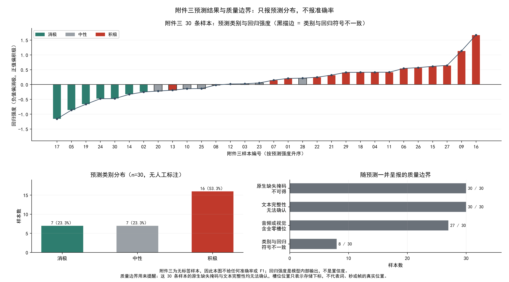

质量边界方面：**27条含音频或视觉全零槽位**，**全部30条的文本完整性无法确认**，**原生缺失掩码亦不可得**。这三条提醒的作用是限定预测的可解释范围——在附件3上，我们只能报告预测分布与内部一致性，不能报告任何准确率类指标。

#### 4.7.3 逐条异常说明

27条含A/V全零候选，合计131/135行。这些行**不视为官方缺失长度**——因为原生缺失掩码不可得，本文无法区分它们是官方接口的真实零值还是提取失败。20号达到50位置上限，**截断与否未知**，这是官方固定50槽接口的固有边界，本文不做推测性补全。

8条精确符号冲突中7条为中性对应非零强度，13号为正向分类但负强度，均保留原输出。这里再次强调：**符号冲突不等于错误**。中性的语义本身允许强度非零（"有点喜欢"与"非常喜欢"在极性上都是正向，强度差异才是重点），因此"分类为中性而回归为正"在语义上并不矛盾。本文保留全部冲突而不做修正，正是为了让这一现象可被读者独立观察。

### 4.8 冻结模型的测试集终检

#### 4.8.1 冻结内容与访问顺序

开发结束后，本文固定原M3代表检查点、训练集统计、BERT权重、标签映射及argmax规则，**不将验证集并入训练**。终检只评价该模型，不在测试集上比较候选、种子或选权规则。

访问顺序是被刻意规定的：**先保存清洁及42个固定缺失场景的全部预测，再读取本次计分所需的标签**。这一顺序的意义在于，预测一旦保存就不受后续看到标签的影响，也无法被追溯调整。代价是流程不可逆——若保存后的预测有误，只能如实报告而不能重跑。**本次新增训练为0**。

表10报告同一模型在两个不同划分上的成绩。

表10 冻结代表模型的清洁验证与测试结果

| 指标 | 验证集 728条 | 测试集 727条 |
| --- | --- | --- |
| 正确条数 | 457 | 483 |
| Accuracy | 62.7747% | 66.4374% |
| Macro-F1 | 0.607804 | 0.630441 |
| Weighted-F1 | 0.629657 | 0.667115 |
| MAE 越小越好 | 0.587535 | 0.625879 |
| Pearson | 0.655286 | 0.689899 |

#### 4.8.2 结果与不可比较性

测试集正确483/727条，Accuracy为66.44%；验证集仍为457/728，即62.77%。

**二者不是同一批样本上的受控改进，不能把差值作为本轮调参收益。** 这个 3.67 个百分点的差距来源是多方面的：测试集与验证集的样本构成不同、标签分布不同、难度不同。把它解读为"调参带来了提升"是一种典型的方法论错误。正确表述是：同一模型在两个独立划分上分别得到62.77%与66.44%。

测试MAE为0.6259，高于验证0.5875，**故分类指标较高也不意味着全面改善**——分类与回归两个方向在不同划分上未同步变化，进一步支持了双任务独立报告的必要性。

中性类仅73/158条正确，召回率46.20%、F1为0.4424，85条中性误分中30条判负、55条判正。中性类在测试集上依然是最大的性能瓶颈，与4.5.1节在验证集上的观察一致。

图17给出测试混淆矩阵和分类表现。

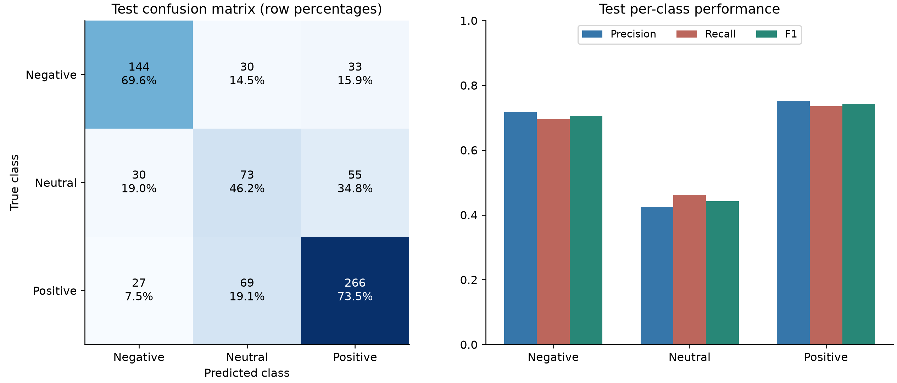

#### 4.8.3 43场景终检与结论边界

清洁加42个缺失场景的等权平均Accuracy为63.52%、Macro-F1为0.6035、MAE为0.6714；仅42个缺失场景分别为63.45%、0.6029和0.6725。43场景与仅42场景的差异很小（0.07个百分点），说明清洁场景的加入没有改变总体格局。

三点边界必须申明。**第一**，43场景复用同一批727条样本，**不是43份独立测试集**。**第二**，本次全部样本可构造预定局部缺失——这一点与验证集不同（验证集有4条 $L_i<2$），这是因为测试集的槽位长度分布恰好都满足条件，属于数据事实而非设计选择。**第三**，该终检是**首次正式模型性能评价，而非测试数据所有信息首次被接触**——2.1节已披露早期审计时曾访问过测试集元数据与少量接口数值，因此本文不声称终检具有完全盲测的独立性。

终检后的独立探索另列于4.9节，不重复测试、不更换正式模型，也不将原测试成绩用于验证新候选。附件3和附件4仍因无真值而不报告准确率。

### 4.9 终检后的独立优化实验

#### 4.9.1 目的与不可追述性

为检验跨模态交互、整模态训练缺失和文本参数适配的作用，本文分别在原M3上增加**一项**改动，各用三个固定种子，合计**9次**真实数据拟合。三个候选**互不叠加**，基线复用已核验的同种子轨迹，不再拟合。每项配置均在本项训练前固定。

最关键的边界是：**该轮发生在原测试终检已被观察之后**，仅使用3395条训练与728条验证样本，属于开发探索，**不能补作新的盲测或初始消融证据**。也就是说，这一节的任何结果都不能用来声称"我们在测试前就发现过这个现象"。

这三项设计的动机直接来自4.5.4节的核心发现：既然含文本与否是主要分界，那么可能的解释有两条——一是模态间缺少交互（模型无法用文本引导音视频、也无法用音视频修正文本），二是文本表示过于强势（768维预训练表示压制了25/74维低层描述子）。三项实验分别针对这两条解释与训练时的整模态鲁棒性。

#### 4.9.2 三项设计

**轻量跨模态注意力。** 借鉴跨模态注意力建模关联的思路[8]，在三分支64维时序隐藏状态与池化之间加入一个共享双头注意力层。每个目标模态**仅以另外两个模态的可观测位置为键和值**，注意力输出经逐模态的零初始化残差系数加入原隐藏状态。无可用源时残差为零，缺失查询不进入池化；保留原缺失掩码、质量输入与动态门控。

三处设计说明：**（a）** "仅以另外两个模态为键和值"意味着模态不会自己查询自己，避免了自注意力与跨模态注意力混同；**（b）** 零初始化残差系数使**初始化时该候选与同种子原M3完全等价**，从而保证比较起点一致；**（c）** 这里的"质量"仅指观测比例，不是语音信噪比或人脸检测置信度——后两者本文没有估计。

新增16963个参数，总可训练参数148237。本实现是**单层轻量候选，不是文献完整网络的复现**，且未做等参数量对照。

**整模态随机失活。** 参考ModDrop的训练扰动思想[9]，维持原M3结构与局部缺失增强。每次呈现训练样本时，以0.10概率从当前可用模态中等概率移除一个**完整模态**，前提是移除后至少还有一个可用模态。使用独立随机数流并保存逐批选择；验证和推理时关闭该扰动。

设计要点：**文本被整体移除时，整个文本分支不可参与融合，避免完整文本缓存泄露**。这是与4.1.3节输入端遮挡同一条纪律的延续——如果移除文本却仍让完整文本编码进入融合，这个实验就变成了"假装缺失"，与题目的局部缺失约束不符。该候选不增加模型参数，也不混入跨模态注意力或类别加权。

**LoRA参数适配。** 按低秩增量形式 $W'=W_0+(\alpha_L/r)BA$[10]，仅在BERT末4层的Query和Value投影加入秩 $r=4$、缩放 $\alpha_L=8$ 的适配器，新增49152个可训练参数，与原M3合计180426个。基座权重冻结，BERT保持评估模式，适配器dropout为0；预测器和适配器的学习率分别为0.001和0.0001。

关键实现约束：**以原生词元在线前向和反向传播，不在冻结的最终文本特征上伪作微调**。若直接在已缓存的768维文本特征上训练低秩矩阵，那不叫适配BERT，而是在冻结表示之上再加一层线性变换，与"文本表示是否过于强势"这个问题无关。每次BERT前向前执行输入端遮挡，保留原位置；标准化仍使用原训练集统计。仅保存低秩参数与预测器，**未全量微调BERT**。

#### 4.9.3 训练预算与复核门槛

三项均沿用CE加MAE/3、batch32、最多30轮和patience5，以清洁验证联合损失最低选权。跨模态注意力与随机失活的三个种子分别训练8/6/7轮、选择3/1/2轮；LoRA分别训练8/7/7轮、选择3/2/2轮。**未因初步结果追加配置、延长预算或挑选最好种子。**

复核门槛**预先沿用本项目规则**：清洁Accuracy均值至少增加0.5个百分点，**至少两个种子提高**，且清洁F1、MAE和43场景三项均值不劣化。该门槛不是显著性检验，满足时也不会自动替换正式模型。设置"至少两个种子提高"这一条，正是为了排除"单一种子偶然跳高"的情况被误认为改进。

表11 三项独立优化的清洁与43场景验证均值

| 优化方案 | 清洁Acc/% | 清洁F1 | 清洁MAE | 43场景Acc/% | 43场景F1 | 43场景MAE |
| --- | --- | --- | --- | --- | --- | --- |
| 原M3 | 62.36 | 0.5723 | 0.5903 | 60.27 | 0.5568 | 0.6142 |
| 跨模态注意力 | 61.40 | 0.5300 | 0.5960 | 59.59 | 0.5184 | 0.6198 |
| 整模态随机失活 | 61.36 | 0.5253 | 0.5960 | 59.39 | 0.5099 | 0.6202 |
| LoRA | 62.32 | 0.5696 | 0.5911 | 60.33 | 0.5563 | 0.6144 |

#### 4.9.4 结果

表11均为三个配对种子的均值，F1指Macro-F1；MAE越低越好。

跨模态注意力和随机失活的清洁Accuracy较基线分别下降0.96和1.01个百分点，原43场景三项均值也变差。LoRA清洁Accuracy下降0.046个百分点，仅一个种子提高；43场景Accuracy上升0.063个百分点，但F1和MAE略差。**三个候选均未通过综合门槛。**

这一结果对4.5.4节的解释有直接意义：**在本文的配置与预算下，加入跨模态交互并不改善性能**。这说明"含文本为主分界"这一现象至少有相当部分来自特征表示本身的不对等，而不是缺少模态间交互——但要注意，这一结论只在**单层轻量注意力**这一实现下成立。

图18展示均值与种子波动，不据细小差异声称统计显著。

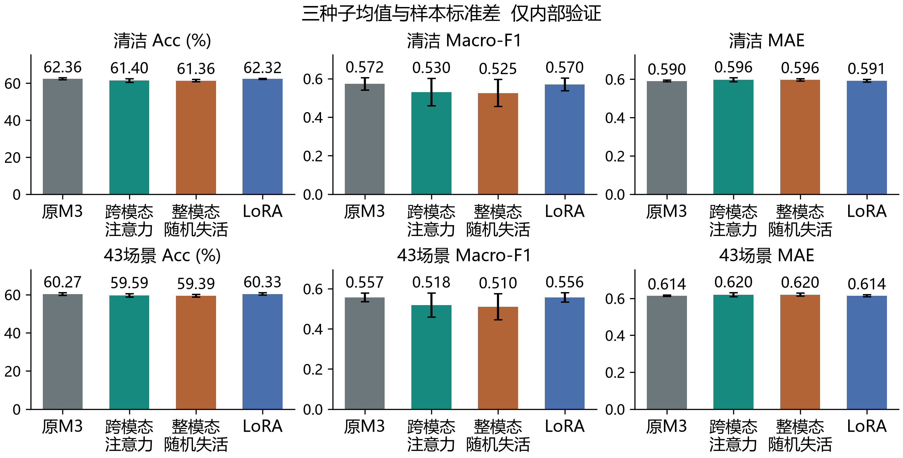

表12 中性类别与整模态缺失压力测试均值

| 优化方案 | 中性P/% | 中性R/% | 中性F1 | 整模态Acc/% | 整模态F1 | 整模态MAE |
| --- | --- | --- | --- | --- | --- | --- |
| 原M3 | 49.23 | 30.07 | 0.3527 | 49.88 | 0.4293 | 0.7513 |
| 跨模态注意力 | 47.30 | 20.65 | 0.2340 | 49.42 | 0.3995 | 0.7172 |
| 整模态随机失活 | 33.44 | 19.93 | 0.2225 | 52.48 | 0.4363 | 0.7026 |
| LoRA | 48.32 | 29.53 | 0.3410 | 50.27 | 0.4342 | 0.7476 |

中性P/R分别为清洁验证的精确率和召回率，表中各值先逐种子计算再平均。整模态压力测试分别完全移除T、A、V、TA、TV、AV，六场景仍至少保留一个模态，等权汇总且不混入原43场景。额外的TAV全空输入只检查训练先验回退，**全部728条均触发回退，恒定输出的Pearson未定义，不计入六场景均值**。

压力场景与清洁验证复用同一批样本，**不是独立测试集，也未用于选权**。这两条限定很重要：压力测试使用与早停相同的样本，因此它同样带有对评估数据的使用痕迹，不能按独立检验解读。

#### 4.9.5 压力测试的取舍解读

随机失活使六场景Accuracy从49.88%升至52.48%，Macro-F1从0.4293升至0.4363，MAE从0.7513降至0.7026；但**清洁中性召回率从30.07%降至19.93%**。跨模态注意力的整模态MAE也有所改善，分类却下降。LoRA六场景指标略有改善，但不足以抵消清洁与原43场景的取舍。

这里出现了一个典型的两难：随机失活在**整模态缺失**条件下全面改善，却在**清洁+局部缺失**条件下恶化中性召回。因此**不能概括为所有方法在所有缺失条件下均无收益**，也**不能据压力均值上升宣称总体精度改善**。二者的差异正说明"鲁棒性"不是一个单一维度——在一种缺失模式下变好，可能在另一种下变差。

当前保留原M3。这些结果只限定于本数据、轻量配置与共同早停预算，**不否定其他注意力结构、失活概率或LoRA秩的可能效果**。

#### 4.9.6 独立核验

独立核验重放全部保留轮次和选中模型的验证场景，跨模态注意力另用显式Q/K/V实现核对，随机失活重建逐批选择，LoRA使用合并权重 $W'$ 与原M3进行对照。

LoRA首次核验因浮点误差阈值失败，**保留失败记录**后采用 $2\times10^{-5}$ 绝对容差并要求分类决策完全一致，三个种子均通过，**未重训首个种子**。这一处理体现了本文对失败记录的一贯做法：保留、记录、说明放宽的理由，而不是删除重跑。阈值从"严格相等"放宽到 $2\times10^{-5}$ 是必要的，因为LoRA的合并权重 $W'=W_0+(\alpha_L/r)BA$ 涉及不同计算顺序的浮点累加，逐位相等不可实现；但"分类决策完全一致"这一更强的约束被保留，确保放宽容差没有掩盖实质差异。

全文汇总另从保存预测复算四组、三种子、50场景共600组指标，并校验样本身份与来源哈希。**数值一致性仅说明实现和汇总可核验，不能替代独立泛化评价。**

## 5 问题3 冻结模型的解释与证据验证

### 5.1 积分梯度与解释目标

#### 5.1.1 为什么选积分梯度

解释沿用代表M3及原训练统计，预测器不再训练或选型。这是"冻结"一词的具体含义：整个第5章不修改任何一个模型参数，只做前向计算与干预实验。若不冻结，所有解释结论都会失去对象——"模型为什么这样预测"这一问题必须先有一个固定的模型才能提问。

本文采用积分梯度（Integrated Gradients，IG）[7]。选择IG而非更简单的梯度或注意力权重，理由有三点。**第一**，原始梯度是局部量，在ReLU网络中容易饱和至零，无法反映远离参考点时的累积重要程度；IG沿参考到输入的路径积分，正是为弥补这一缺陷而设计。**第二**，注意力权重或门控权重是模型内部权重，本文在4.2.3节已明确其不等于因果贡献；而IG满足两条可检验的公理（见5.1.3节），具备可被证伪的结构。**第三**，IG的输入空间就是特征空间，因此"把某个特征块置零"这一干预实验可以与归因值直接对照，形成自洽的验证闭环——这是选择IG最实质的理由。

输入为标准化后的BERT输出与官方A/V特征，离散内容域和缺失掩码固定。这一点很关键：**离散域在解释过程中必须固定**，因为内容域是可观测性的定义基础，若在归因时允许内容域变动，"某个位置是否存在"就会与"该位置的数值多大"混在一起，两者的归因无法分离。

分类目标是原预测类别的logit（而非softmax概率），强度目标保留回归正负号。使用logit而非概率是为了避免softmax的归一化把不同类别的归因卷到一起。对于输入维度 $d$、参考 $b$ 及目标函数 $F$，定义

$$
\mathrm{IG}_d(x;b)=(x_d-b_d)\int_0^1\frac{\partial F(b+\lambda(x-b))}{\partial x_d}\,d\lambda.\qquad (15)
$$

式(15)的直觉是：把输入从参考点 $b$ 一路线性插值到真实输入 $x$，沿途不断累积每一维的梯度，再用总位移 $(x_d-b_d)$ 加权。若某一维在整条路径上的梯度都很大且位移也大，其归因值就大。

#### 5.1.2 数值实现与参考选择

积分用Gauss-Legendre求积，主设为**32步**；只有当32步未达到组合容差时才升到64步。使用32步而非更少，是因为在M3这种多层非线性网络中，梯度路径的曲率可能较大，步数不足会带来系统性误差；而使用Gauss-Legendre而非等距黎曼和，是因为前者在相同函数评估次数下有更高阶的精度。

组合容差为

$$
\left|\sum_d\mathrm{IG}_d-[F(x)-F(b)]\right|\le0.001+0.01|F(x)-F(b)|.\qquad (16)
$$

式(16)是IG的**完备性公理**在数值上的近似形式：所有维度的归因之和应当等于"从参考到输入的总输出变化"。容差采用"绝对项加相对项"的组合而非单一阈值，原因是大输出值的绝对误差天然更大——若只用绝对容差0.001，输出量级较大的样本将几乎不可能通过；若只用相对容差，输出接近零的样本又会过于宽松。两者的和为实际残差判定提供了合理尺度。

**参考基线 $b$ 选择训练集均值**（即标准化空间中的零向量）。选择均值参考而非"全零输入"或"随机基线"，是因为均值在标准化空间中的含义明确（"该维的平均水平"），且对所有维都合法地处于数据分布内部，不会引入分布外的中间状态。中位数参考只作敏感性检查——若结论对参考选择高度敏感，就说明该归因不稳定，这一点在5.3节和5.4节都有报告。

#### 5.1.3 模态归因的聚合与三条读法限制

对模态 $m$，报告有符号净贡献 $C_m=\sum_{d\in m}\mathrm{IG}_d$ 及份额 $s_m=|C_m|/\sum_k|C_k|$，同时保留绝对归因总量作为后备信息。这样设计是因为净贡献与绝对总量的含义不同：净贡献反映"该模态总体把输出推向哪个方向"，而绝对总量反映"该模态是否被大量使用（无论方向）"。两者在某些样本上会给出不同印象，本文把两者都保留，不择一报告。

三条读法限制必须同时成立：

**其一，分母不超过 $10^{-8}$ 时不指定主模态。** 当归因总量接近零时，"份额最大者"在数值上已无意义，此时报告主模态是一种虚假的确定性。本文直接返回"无主模态"。

**其二，距离最大份额不超过0.01的模态保留为近似并列。** 举例说明：若两个模态份额分别为0.505与0.497，指定前者为"主模态"是不合理的，因为差距小于数值噪声。本文在此情形下并列报告，而**不强行二选一**。这条规则正是4.9节所观察到的"01和14的强度主模态随参考变化"现象的判定依据。

**其三，模态内部正负抵消会影响净份额。** 若某模态内部一半特征强烈为正、一半强烈为负，其净贡献可能接近零，但该模态实际上被模型大量使用。因此**份额不是概率，也不是因果权重**——它只描述模态整体的净方向，不描述模态内部的使用强度。这是净份额最容易引起误读的地方。

此外，两个头部的符号含义不同：**分类正IG支持原预测类别，即使该类别为负向**——因为分类目标本身就是"原预测类别的logit"，正归因只说明"抬高了这个已被预测的类别"。**回归正IG仅表示相对参考推高强度**，与情感的正负极性无关。把分类与回归的归因符号混读，是把"支持模型判断"误读为"支持情感极性"，属于必须避免的错误。

### 5.2 连续关键块与匹配对照

#### 5.2.1 为什么要构造"连续块"而非逐个特征

关键块沿用20%与50%目标比例及式(8)的块长规则，且**所有位置必须为原可观测内容**，不能跨缺口、不能含padding、不能覆盖整个模态。

三个约束各自对应一个具体问题。**不跨缺口**：若允许块跨越缺失区间，那么"遮蔽这个块"与"遮蔽一个本来就缺失的区间"会混在一起，干预效应就无法归因于被遮蔽的内容。**不含padding**：padding本身不承载信息，把padding纳入块会稀释20%/50%的实际遮蔽比例。**不覆盖整个模态**：若块等于整个模态，该实验就退化为"整模态移除"，与局部块干预不是同一命题——本文把二者分开处理（整模态移除另在5.3节报告）。

在块的选择上，分类与回归采用**不同**的判据：分类选择**有符号归因和最大**的块，回归选择**净归因绝对值最大**的块并保留其符号。原因在于分类目标关心"把输出推向目标类"，故取有符号和；回归目标关心"改变的幅度"，故取绝对值。并列时在 $10^{-12}$ 容差下取最早合法起点，保证结果可复现。

一个关键限制：**分类最高值非正时，不把该块称为正支持证据**。也就是说，即使某个块被选为"归因和最大"，若其值为负，它也不能被宣称为"支持原预测的证据"。5.3节将报告分类20%与50%分别有16及38个最高归因块仍非正——正是这条规则的直接后果。

#### 5.2.2 匹配随机块与控制变量

判断"关键块重要"不能只看它的干预效应大不大，必须与**位置匹配的随机块**比较。本文把合法起点按秩分为三层，每个样本、模态、比例、层在**归因之前**固定10个等长、均匀、有放回的随机块。随机块可以重复，也可以与关键块相同；各目标与参考共享同一份清单。

四点设计意图：

- **在归因之前固定**：若先看归因再挑随机块，就等于用结果来构造对照，比较将失去意义。
- **按秩分三层**：序列不同位置的归因方差不同，完全随机抽样会让对照块的分布偏向某些位置；按秩分层后，对照块与关键块在"位置好坏"这一维度上大致可比。
- **有放回**：允许重复使抽样过程简单且无偏，代价是样本多样性略低（已在容差内接受）。
- **共享清单**：保证分类头与强度头、均值参考与中位数参考面对同一批对照块，避免不同配置之间出现对照差异。

必须坦白的是：**位置匹配是分层近似，不是精确位置相同**。若要求关键块与对照块起点完全一致，对照块就会退化为关键块自身（起点相同且等长则完全重合），配对差恒为零，检验失效。因此本文采用"分层近似匹配"，并把这层近似作为已知的保守因素而非缺陷——它使对照块更难被区分，从而让显著结果更具保守性。

#### 5.2.3 干预定义与配对差

特征干预的做法是：**把标准化特征置零并同步更新缺失掩码**，原内容域和分类目标保持不变。同步更新掩码是关键的一步——若只把特征置零而不更新掩码，模型仍会认为该位置"存在观测"，只是数值恰好为零，这与"该位置不可观测"是完全不同的输入。本文通过掩码更新让干预在语义上真正成为"移除观测"。

设 $D(S)=F(x)-F(x_{\setminus S})$ 表示遮蔽集合 $S$ 后目标函数的变化，主配对差分别为

$$
\Delta_c=D(S_{\mathrm{top}})-\frac{1}{10}\sum_{j=1}^{10}D(S_j),\qquad\Delta_y=|D(S_{\mathrm{top}})|-\frac{1}{10}\sum_{j=1}^{10}|D(S_j)|.\qquad (17)
$$

式(17)的含义是：关键块的干预效应减去10个匹配随机块的**平均**干预效应。分类取有符号差，回归取幅度差（绝对值），与块选择规则保持一致。

**分类量纲为logit变化，强度为变化幅度，不能比较两者大小来判断哪一头更"正确"。** 两者数值不可通约，这一点在报告全部结果时反复出现。

#### 5.2.4 分组自助法：为什么按视频整组重抽

置信区间的估计采用分组自助法（grouped bootstrap）：**每条先平均三模态配对差，再按原video_id整组有放回抽样5000次，保留组内全部已选片段。**

"按视频整组"这一设计是本节统计上最重要的决定。原因在于：同一段原视频的不同片段共享说话人、录音环境、语速与内容风格，因此它们的配对差**不是相互独立的**。若按片段独立重抽，会低估抽样方差，产生过窄的置信区间与虚高的显著性。按video_id整组重抽，等价于把"视频"而非"片段"作为抽样单位，从而正确反映数据中的组内相关性。

样本范围的边界也必须明确：**区间仅描述预先选定的60条、54个视频组，不外推总体**；该名单每类20条并按长度规则固定，**并非随机总体样本**。这意味着表13的置信区间是"在这60条上"的区间，而不是"在全部数据上"的区间估计。把前者的区间套到后者上，是一种常见的越界使用。

### 5.3 解释验证结果与反例

#### 5.3.1 收敛性与残差

60条、两参考、两目标共**240组IG**，全部在**32步**达到组合容差，无需升级到64步。最大绝对残差为**0.0064728952**。

这个残差数字需要正确解读：它大于0.001，因此**不能写为"全部小于0.001"**。式(16)的容差是复合形式，对该样本而言 $0.001+0.01|F(x)-F(b)|$ 的上限超过了0.00647，因此仍在容差内通过。本文如实报告最大残差的绝对值，而不报告一个更容易被误读的结论。

干预方面：**5823个局部窗口与180个整模态移除，合计6003次干预，1440组配对全部保留**。这一数字的用途是支撑"全部结果均被记录、未做筛选"这一声明。

表13复用已保存的主参考结果，不重新抽样。

表13 60条验证样本的平均局部忠实性

| 目标 | 比例 | 配对差均值 | 均值95%区间 | 非正配对差 | IG与实际D方向相反 |
| --- | --- | --- | --- | --- | --- |
| 分类 | 20% | 0.047282 | [0.037905, 0.057589] | 16/180 | 14/180 |
| 分类 | 50% | 0.030714 | [0.023383, 0.038715] | 28/180 | 37/180 |
| 强度绝对影响 | 20% | 0.027422 | [0.022006, 0.033496] | 13/180 | 1/180 |
| 强度绝对影响 | 50% | 0.019721 | [0.014268, 0.025822] | 29/180 | 4/180 |

#### 5.3.2 平均局部忠实性的正确表述

四组均值区间均高于零，支持"在给定特征替换规则下的平均局部忠实性"。

这一结论的表述边界极其重要。**它不是预测准确率提高**，也不是"模型解释正确"。它只说明：在本模型、本参考、本干预定义下，关键块的干预效应平均而言高于位置匹配的随机块。这是一个关于**模型内部行为**的陈述，而不是关于模型是否正确、或情感成因是否如此的陈述。

表中非正配对与方向反例每一行基于**180个模态配对**（60样本×3模态），**不是180个独立视频**。这一点与5.2.4节的整组重抽逻辑一致：配对数看似很大，但背后只有54个独立的视频组，因此不能按180个独立观测来计算显著性。

分类20%与50%分别有**16及38个**最高归因块仍非正；分类50%的视觉方向反例达**20/60**。图19同时展示参考、目标及模态差异。

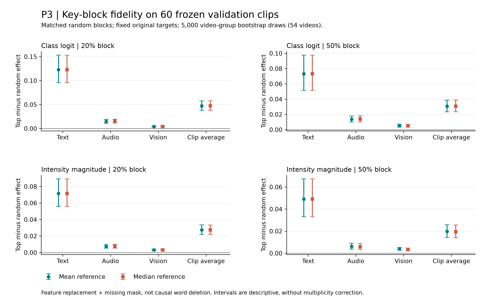

这些反例的存在本身就是本文方法论的证据：本文报告"平均高于零"，同时报告"存在大量非正配对与方向反例"，两者并不矛盾——平均值可以在有大量反例的情况下仍为正。若只报告均值而不报告反例比例，读者会误以为解释在每条样本上都成立。

#### 5.3.3 参考敏感性与干预方式敏感性

分类主模态在均值参考和中位数参考下**60/60一致**，强度为**56/60**——即4条强度样本的主模态随参考改变。与整模态移除得到的主模态比较则分别为**57/60**和**45/60**。

三组数字的对比揭示了一个清晰的规律：**分类的归因结构比强度稳健得多**。分类在两种参考下完全一致，说明其主模态判断不依赖参考选择；而强度在"特征块干预"与"整模态移除"两种干预方式之间只有45/60一致，说明强度头对干预方式高度敏感。

两点说明。**其一**，整模态移除可能产生**分布外（out-of-distribution）** 的输入——移除整个模态会使模型面对训练时极少出现的情形，因此其效应不能与局部块干预直接相加或比较。**其二，各移除效应不能强行相加为总贡献**：模态之间存在交互，$C_T+C_A+C_V$ 不等同于"全部移除"的效应。这正是合作博弈中需要用Shapley值而非简单求和的原因，本文未做Shapley分解，故明确声明不做加总。

因此，**强度对参考和干预方式更敏感，应与分类结果分别呈现**，不能合并为一个"解释稳健性"指标。

#### 5.3.4 输入端探针：区分"特征遮挡"与"语义删除"

为区分特征遮挡和输入语义变化，本文固定3条样本执行**BERT输入端探针**，共12组比较。

这一实验的动机是：IG与特征干预都在**BERT输出的768维特征空间**上操作，而BERT输出的每一维并不是独立的语义单元——它们由自注意力共同产生，单个维度的贡献无法对应到具体的原词。因此"特征层平均忠实性通过"不能推出"删除完整原词也有效"。

探针结果：**分类6组中2组关键块不优于随机，配对差为-0.006548和-0.155813**；**强度6组均为正**，但样本量太小，不足以支持总体结论。

这两条结果的报告方式体现了本文的一贯原则：2/6的分类失败被如实列出并给出具体数值，而不是以"大多数通过"掩盖。同时明确说明"强度6组均为正"不能作为结论——12组比较、3条样本远不足以支撑任何总体性论断。

结论边界：**BERT上下文特征并不是相互独立的原词语义单元，因此特征层平均忠实不能推出完整原词删除或真实语义干预同样有效。** 这也直接限制了5.6节的时间定位能力：即使能定位到"模型关注1.2秒附近的特征"，也不能等价于"这个原词决定了预测"。

### 5.4 附件4预测与坐标边界

#### 5.4.1 预测口径

对附件4对齐版01至20沿用冻结模型、训练统计与原全零行规则，**不额外训练、遮挡或集成**。预测结果为负向7条、中性4条、正向9条，完整表见附录C；**无真值不能计算专项准确率**。

归因方面：**80组IG**（20样本×2参考×2目标）均在32步通过组合容差，最大残差0.0032177668——**小于5.3节60条样本集的0.00647**，说明这20条的归因数值路径更平滑。**2367次干预及480条局部证据全部保存**。

#### 5.4.2 模态分布与统计边界

分类主模态T为19条、V为1条；强度T为16条、A为3条、V为1条。

这一分布必须立即加限定：**这是本20条的模型净归因分布，不代表现实情感因果结构。** 同一批数据、同一个模型、同一套干预规则就会得到这个分布；换一个特征提取方式，分布可能完全不同。4.5.4节已指出文本表示与A/V特征在信息密度上不对等，这里的分布正是那一现象的延伸，而不是对"情感主要由什么决定"的回答。

主参考下**12/20条至少一个局部配对差非正，7/20条有方向反例**；**01和14的强度主模态随参考变化**。因此**不称每条解释都获支持**——20条中有12条存在非正配对，这是多数。

#### 5.4.3 四联图的读法

图20把20条的预测分布与质量边界并列呈现：

- **图20(a)** 纵向堆叠三分类概率，样本05与13的次高类与最高类非常接近，属于**未经校准的边界样本**——softmax未做温度缩放，概率接近不代表真实概率接近50%。
- **图20(b)** 按既有 `class_regression_sign_conflict` 口径，附件4中有4条类别与回归头分歧，分别为01、05、14、18。按本文4.5节已确立的读法（区分"中性对应非零强度"与"正向分类但负强度"），这4条可进一步分成两类：**01、05、14为中性分类与正回归强度**（+0.1014、+0.3369、+0.2030），**18为中性分类与负回归强度**（−0.2593）——后者才是严格意义上的符号方向相反，前者是中性类别与非零强度的组合。本文保留原输出，不通过阈值或符号规则强行修正。与4.5节验证集上29.12%的符号不一致率相比，附件4这20条上的分歧比例更低，但并非0条。
- **图20(c)** 给出主要模态计数，可见文本在两个头上都占绝对多数，这是**本批数据与冻结模型的特性而非情感成因**。
- **图20(d)** 统计480条证据的质量标记，其中**43条关键块不优于随机块、39条分类无正支持**，说明解释并非全部获支持。这两类标记与5.4.2节的12/20非正配对数相互印证，是同一现象在证据行级别与样本级别的两种计数方式。

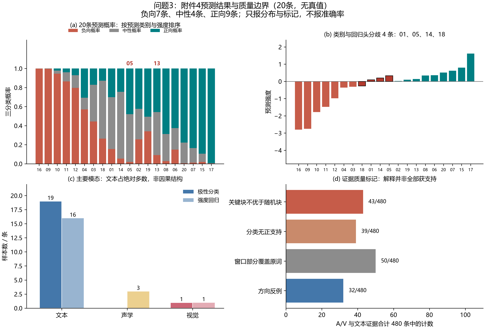

#### 5.4.4 逐样本模态构成

三模态贡献的逐样本构成由图21给出，上下两栏分别为分类头与强度头。多数样本由文本主导（深蓝占比高），少数样本声学份额显著上升（如05、08、10、13的强度头），19号则为视觉份额异常突出，**需结合其输入质量一并阅读**——19号的视觉份额高，可能源于视觉输入本身有特殊结构，而不等于视觉真的在那里提供了情感信息。

该图只显示绝对值净份额的构成比例，既**不是预测置信度**，也**不是因果贡献**。不能据份额大小推断某个模态在现实中更"重要"。这一限定与5.1.3节第三条读法限制完全一致：净份额会被模态内部的正负抵消影响，其大小不直接等于使用强度。

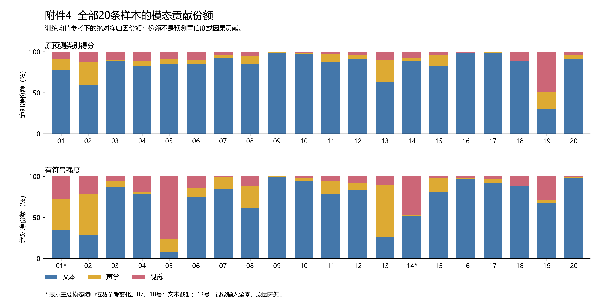

#### 5.4.5 坐标边界的三个具体情形

文本子词按已核验字符映射累计到原词，字符和特征区间采用零起始左闭右开。三种情形需要单独说明：

**第一，07与18分别有15及7个原词未进入模型**，贡献记为`null`。这些词在官方50槽接口中没有对应位置，**不能补作当前模型证据**——补零或估算都会制造出模型从未产生过的归因值。

**第二，13号的30个内容槽位视觉原始输入全零且原因未知。** 中心化后仍可能产生非零IG，因此**不能据此声称面部动作存在**。这一条与3.4.2节"自然零为0"的推论相互呼应：在问题1中我们已确认视觉缺口全部来自提取失败，因此13号的视觉全零同样更可能是提取问题而非真实的无表情。

**第三，也是最重要的坐标边界：官方A/V特征槽位到原词、时间、帧号的来源关系仍未知。** 因此**320条A/V证据只报特征槽位**，其词索引、字符、秒、帧、音频采样位置**均为`null`**。本文不填任何推测值。

文本字符证据另经自行重建的候选词时间支持媒体回看，方法与人工核查见5.6节。三模态等长、媒体配对及重新强制对齐**均不能单独证明官方特征来源**；候选文本时间**不填入官方A/V归因坐标**。这两条合起来界定了本节的坐标能力：我们能在官方槽位坐标上报告归因，也能在自行重建的候选时间坐标上做回看，但**两条坐标之间没有经过验证的换算关系**，因此绝不互相填入。

### 5.5 三个代表案例

#### 5.5.1 案例选择规则

案例规则**在执行前登记**：先保留输入质量异常，再选目标或参考分歧，最后选双头净归因集中且稳定的样本。得到13、01、09三个案例，图22按09、01、13展示。

这条规则的关键在于**不依据预测是否正确挑选**——因为附件4无真值，本来也无法按正确性挑选。规则的三步分别对应三类值得展示的现象：**输入质量异常**（13号的视觉全零）、**目标或参考分歧**（01号的强度主模态随参考变化）、**双头净归因集中且稳定**（09号的文本强主导）。三者覆盖了"数据有问题""结论不稳定""结论很确定"三种情形，读者可以从中看到方法的完整行为谱。

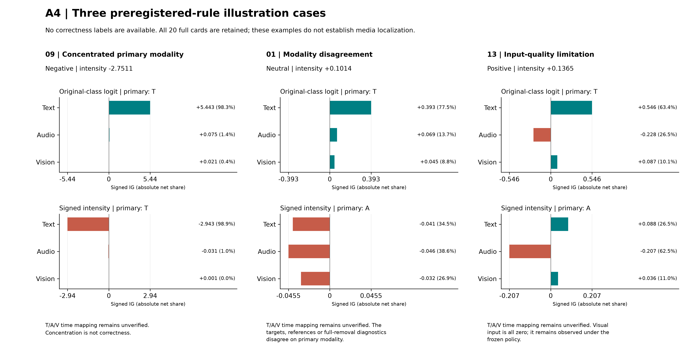

#### 5.5.2 案例09：结论清晰但不可外推

09号预测负向、强度-2.751093，文本分类和强度净份额为98.27%与98.94%。两头20%文本块为特征[5,9)、字符[6,20)，摘录"I did not like"。分类配对差1.009310，强度绝对效应配对差0.110097。

这个案例的价值在于它同时展示了**方法的强项与限度**。强项：一个明确极性表述被定位到具体的特征区间与字符区间，配对差为正且量级明显。限度：**只支持模型内诊断，不证明预测正确**——因为无真值，"I did not like"被识别为负向这件事本身无法被验证；且**低份额视觉窗口仍受参考影响**，说明即使主模态高度集中，次要模态的判断仍不稳定。

#### 5.5.3 案例01：结论依赖参考

01号预测中性、强度0.101426。均值参考下分类以T为主、强度以A为主；中位数参考下强度改为T；整模态移除也以T影响最大。

这个案例的价值是**展示参考敏感性**。同一个样本，仅改变参考基线，"强度主要由哪个模态决定"就变了。因此本文**不能合并成一个确定原因**——若只报告均值参考下的结论，会给出一个比实际更确定的印象。

另有一处需要正确理解：**均值下三个回归净贡献均为负，仅表示低于参考输出，最终强度仍可为正**。净贡献为负是相对参考而言的，它与"最终预测的符号"没有直接关系。把归因符号当作情感极性，是本节最需要避免的误读。

#### 5.5.4 案例13：输入歧义与归因的非零假象

13号预测正向、强度0.136526，正向与中性概率45.64%与45.25%非常接近，且**未经校准**。

两处异常被完整保留：**其一**，视觉原始输入全零，但分类与强度视觉净份额仍为10.09%及11.00%，**不能解释为某帧表情证据**。**其二**，其输入歧义、方向反例与整模态分歧均保留，不做取舍。

这个案例是全文最有教学价值的一个：它说明**归因值非零不等于证据存在**。当输入本身是零向量时，中心化操作仍会产生非零的IG值，因为中心化后的"零输入"与参考基线之间存在差异。若不理解这一点，就会把"视觉份额11%"误读为"模型从面部读到了信息"。正确的解读是：这11%反映的是**输入与参考基线之间的数值差异**，而由于原始输入为零，这个差异更可能来自预处理而非真实的面部动作。

#### 5.5.5 逐位置归因的读法

三个案例的逐位置有符号归因由图23按行展示，每行单独归一化**仅用于显示**。横轴是原始特征位置索引，**不是时间**；黑框标出20%关键块。

三行的对照读法：**09号**文本关键块在分类头上集中且为正（深绿），符合"I did not like"这一明确极性表述；**01号**各模态均较分散、无单一强正块，与其"结论依赖参考"的性质一致；**13号**的视觉行虽然原始输入全零，归因条仍呈非零色块，这正是5.4.5节所述"中心化后仍可能产生非零IG"的直接体现，**不能据色块深浅宣称面部动作存在**。

最后重申：**音视频特征索引不能直接解释为原词、秒或帧号**——这正是图23横轴标注为"特征位置索引"而非"时间"的原因。

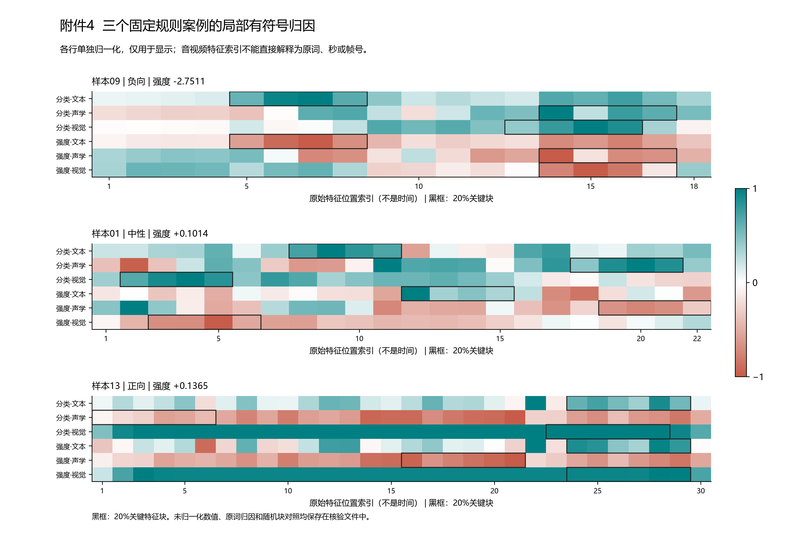

### 5.6 文本候选时间重建与人工回看

#### 5.6.1 重建的条件与边界

在不改变预测器、原归因和官方输入的前提下，本文以配套片段音频和原文本进行条件式强制对齐，把文本字符证据连接到候选词时间包络。时间以配套MP4片段媒体时钟为基准，保留音频采样索引与视频帧PTS，**不能把帧序号除平均帧率作为精确时间**（理由见3.1.2节）。

条件边界必须在开头说明：**文本区间内的同步画面只作回看背景，不被解释为视觉归因或官方A/V特征的来源证明。** 这句话的作用是切断一条诱惑性的推理链——"既然文本词落在1.2秒，而这个时刻的画面里有某个表情，那么模型看的就是这个表情"。这条链的前半段来自本文重建的候选时间，后半段来自对画面的肉眼观察，两者都不具备官方的坐标授权。

#### 5.6.2 重建产物

20条样本共482个原词，其中460词进入当前模型，**07与18的22个尾词仍不计作模型证据**。原480条证据中，160条为文本配置记录，对应20样本、两参考、两目标和两比例，共**52个不同的样本时间包络**。

生成产物为：**160段候选PCM音频、143张去重预览图、5559行视频帧索引**。

有一个容易算错的量需要明确：**同一时间包络可能被不同配置复用，160条记录不是160个独立片段。** 同理，52个时间包络也不是52个独立样本——20个样本、两参考、两目标、两比例的组合中，许多配置共享同一包络。这一数字关系与4.5节"43场景不是43次独立实验"是同一种报告纪律。

09号"I did not like"的候选包络为**1.126至1.608秒**，可与原字符及模型证据对照回看，**但不据此声称边界精度达到毫秒级**——该包络来自本地强制对齐，其精度取决于对齐算法在音频上的表现，而非人工标注。

#### 5.6.3 回看对应图

图24把三个案例文本证据与原媒体的对应关系画在同一时间轴上：左侧灰条为全部原词的候选区间，红色实条与红框为落入关键块包络的部分，右侧为该样本8条配置记录的**单复核者判定分布**。

三例的判定分布差异明显：**09与01的全部8条记录均判为候选可接受**；**15号的8条全部判为语义不匹配**，与其软件转写在语段中断处截断的现象一致。

需要强调两点：**其一**，左侧时间轴是配套片段媒体时钟下的候选包络，其精度来自本地强制对齐而非人工逐词标注，**不能作为官方A/V特征的时间来源证明**。**其二**，右侧"8条记录"是**整样本**的配置记录分布，而非与左侧某一具体包络一一对应——同一时间包络会被多个配置复用，因此这个分布描述的是该样本的总体复核情况。

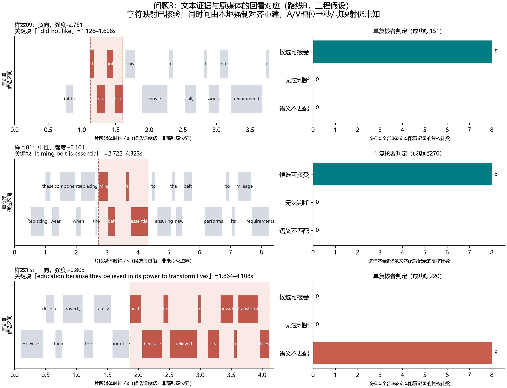

#### 5.6.4 时间戳定位热力图

把逐词文本归因放回该时间包络，即得到图25的关键时间戳定位热力图。每行上下两条分别为分类头与强度头，颜色为有符号归因、逐样本归一显示，白字标出该样本分类头归因绝对值最大的词。

三个案例的表现：**09号**的最强块落在1.2秒附近的"not"上，与"I did not like"的负向表述区间一致；**01号与13号**则较分散；**13号**的关键块还带有`partial_word_window`标记，说明窗口在词边界处被截断。

该图是**路线B下的工程实现**：字符到原词的映射已核验，词到时间的关系由本地重建。因此它能**指示模型关注的时间区间**，但该区间的语义归属、以及音频与画面是否真正同步，**均未经人工确认**；**A/V槽位到词、秒、帧的官方映射依然未知**。这三句构成本图的确切效力范围，任何超出此范围的解读都不被本文支持。

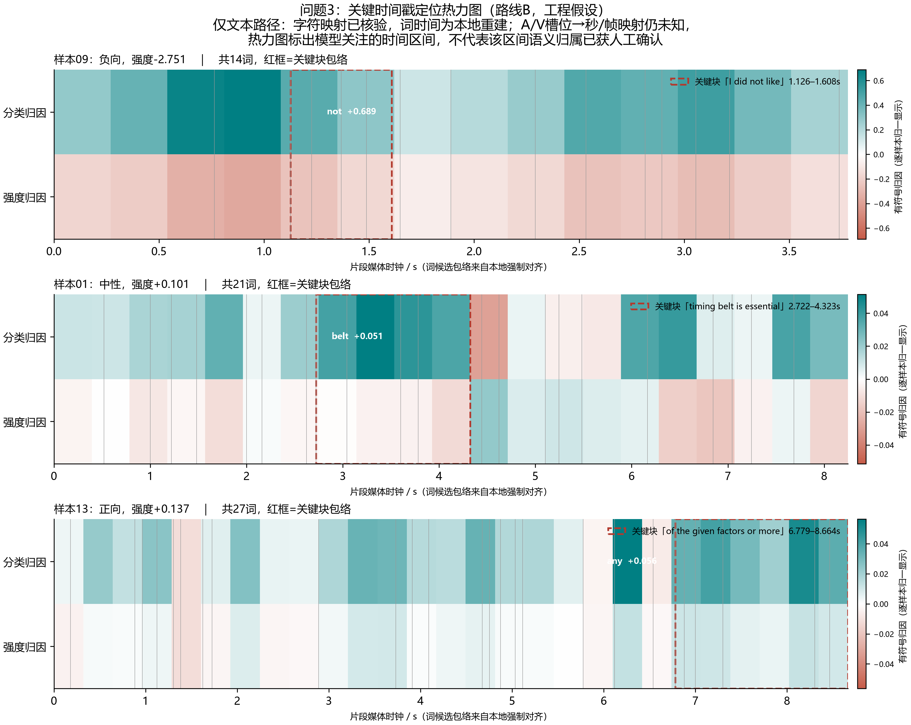

#### 5.6.5 人工回看与单复核者局限

通过本地回看页面，由**一名复核者**对全部160条文本配置记录完成核查。采用最后一次累计导出的记录，原自动候选与先前导出不覆盖。表14按保存状态列出结果。

表14 文本证据候选片段的单复核者核查结果

| 核查状态 | 记录数 | 样本范围 |
| --- | --- | --- |
| 候选可用 | 144 | 其余18条样本 |
| 内容不对应 | 8 | 15号样本 |
| 无法判断 | 8 | 13号样本 |
| 尚未记录 | 0 | 无 |

**144/160即90.00%**——这一数字的解读有三重限制。**第一**，它仅为本次复核者判为候选可用的**记录比例**，**不是预测准确率、逐词定位准确率或语音识别准确率**。**第二**，它由**单复核者**完成，无法估计复核者间一致性，也就无法区分"记录本身有问题"与"复核者判读偏好"这两种来源。**第三**，160条记录中存在重复时间包络，因此它不是160个独立样本上的比例。

异常的具体描述：**15号的8条记录涉及两个时间包络，复核者未听到对应文字**；其软件转写在"however, despite their poverty"处随片段中断，而原文本还包含后续教育语句。该现象提示**媒体片段与原文本语段的覆盖范围可能不一致**，尚不能定位具体原因，**也不证明训练标签或网络错误**——覆盖范围不一致可能来自附件切分规则、也可能来自文本整理方式，本文无法在现有信息下区分。

处理方式是：**保留原文、预测、归因及候选时间**，不将这8条用作有效回看示例。**13号的8条因词语听辨不确定保留为无法判断**，不擅自改为正确或错误——把"无法判断"强行二值化会人为提高"可用比例"，本文拒绝这一做法。

#### 5.6.6 时间边界误差与本章冻结

本次**没有独立人工起止时间标注**，因此**不计算时间边界误差**。这一限制在本文中作为一个明确声明的空白保留，而不是一个待补的缺口——因为补齐它需要完整的人工标注，超出了本题可获得的资源。

本地播放与操作功能由实际使用者确认正常；软件核验用于检查文件引用、导入记录和来源一致性，**不等于独立跨浏览器验收**——这两个概念的区别在于，前者检查"我们的程序能否正确读取和播放"，后者检查"不同使用者在不同软件环境下能否得到一致体验"，本文只做了前者。

至此，问题3按本文采用的"特征归因、文本候选回看与异常披露"范围**完成并冻结**；**不据此声称官方A/V来源映射已核实或获得官方合规认定**。本章的全部结论都限制在这一被明确划定的范围内。

## 6 综合评价与改进方向

### 6.1 方法价值与适用范围

#### 6.1.1 三部分各自贡献了什么

本文的三个部分并非同一方法的三次应用，而是分别针对三类不同的问题。理解它们的差异有助于判断本文的贡献边界。

**特征流程**保留原样本、失败状态和聚合来源，便于复核覆盖损失。它的价值不在于提取出了多少维特征，而在于**每一维都能回答"它由哪些原始观测、经过什么规则聚合而来"**。这一可追溯性使3.6.2节的独立复算成为可能，也使用户能够直接看到"108个词视觉不可用"这类信息，而不是面对一个来历不明的特征矩阵。

**预测协议**在BERT输入端施加文本缺失，避免完整上下文缓存泄露被遮内容。它的价值不在于模型结构本身，而在于**把"缺失"从数据预处理问题变成了被严格定义的干预**：$P$ 与 $M$ 分离、$K_i$ 取整规则明确、缓存绑定四要素。4.1.3节的分析说明，如果不这样设计，"缺失条件下的鲁棒性"这一结论将不可证伪。

**解释流程**使用匹配随机块、参考敏感性和反例，避免仅凭热图说明有效性。它的价值不在于展示模型"看"了哪里，而在于**把解释变成一个可被否证的比较**：关键块必须强于位置匹配的随机块，且这一结论必须在不同参考下被检查，反例必须被报告。

三部分分别支持**特征可追溯、冻结模型的预测表现、特定干预下的局部忠实性**。需要强调最后一项的限定词："特定干预下的"——它描述的是在这个模型、这个参考、这个遮蔽规则下的行为，而不是普遍意义上的"模型理解了情感"。

#### 6.1.2 三条不能互相替代的证据线

文本候选回看与人工核查进一步暴露了语段覆盖和词语听辨问题，但这些证据**不能相互替代**。三者的独立性体现在：

| 证据线 | 回答的问题 | 不能回答的问题 |
|---|---|---|
| 特征可追溯性 | 特征由什么而来 | 对齐是否语义正确 |
| 预测性能 | 在给定划分上表现如何 | 为什么这样预测 |
| 解释忠实性 | 哪些特征影响输出 | 现实中情感由什么决定 |
| 人工回看 | 候选片段是否可接受 | 定位误差有多大 |

这张表的作用是防止"证据叠加"的错觉。看到特征可追溯、性能合格、解释通过比较、人工复看多数可接受，容易产生"四重验证全部通过"的印象；但四条线各自只覆盖一个维度，任何一个维度的通过都不能补偿另一个维度的缺失。例如人工回看的90%可用比例，**完全不能补偿**时间边界误差未测这一空白。

### 6.2 主要限制

#### 6.2.1 问题1的限制

问题1仍有**108个词**视觉不可用，**全部词级语义对应未知**。条件式对齐和名义覆盖**不是发音边界真值**，声学分配区间也**不等于完整物理支持**（因分析窗与平滑滤波引入了区间外的依赖）。

这三条限制的共同后果是：问题1的输出可以被用在依赖"位置"而非"语义正确性"的下游任务上，但**不能**被用来声称"这个词的音频就是这段波形"。本文在§3.5中已把这一限制分层说明，此处不再展开。

#### 6.2.2 问题2的限制

**开发选择偏差**：同一验证集用于早停、选型与报告，且又被后续开发对照反复观察。这意味着本文报告的验证指标是**在多次使用同一批数据之后**的结果，不存在"第一次接触"意义上的独立性。4.6节与4.9节的全部对照都建立在这批已被反复观察的验证集上，因此它们只能支持"这些候选没有明显收益"，不能支持"这些候选在总体上无效"。

**缺失类型的覆盖限制**：本文的缺失只覆盖既定的**同步连续块**和新增的**整模态移除**，**不能代表异步、多段、噪声或真实设备故障**。真实场景中的缺失往往是"某几段音频被杂音覆盖"（噪声）或"音频与视频不同步"（异步）或"网络抖动导致多段丢包"（多段），这些形态与本文构造的连续块在模型行为上可能完全不同。

**统计强度限制**：M3三种子优势不稳定（0.5568 vs M0单种子0.5578），M0至M2只有单种子；新增结构也**没有等容量对照**（4.9节的跨模态注意力增加16963参数、LoRA增加49152参数，均未做参数量匹配的比较）。

#### 6.2.3 问题3的限制

**解释样本非随机**：60条验证样本与20条附件4样本均按规则选定，**并非总体随机样本**，且存在输入层反例、参考分歧和潜在分布外干预（如整模态移除）。

**无真值与坐标未知**：附件3与附件4**无真值**；**320条A/V证据的官方媒体来源未核验**，其词索引、秒、帧全部为`null`。

**复核局限**：文本回看由**一人**完成，多配置记录存在重复时间包络，**没有独立人工边界**，因此**不能估计定位误差或复核者间一致性**。

**指标混淆风险**：软件检查数、积分收敛率、模型概率、候选可用比例及图件数量**均不能替代预测正确率或定位准确率**。这五类数字在本文中大量出现，它们的用途是描述工程完备性与内部一致性，而不是效果评价。

#### 6.2.4 终检的独立性限制

最终测试只覆盖**事前冻结的一个代表模型**，未提供多个模型的独立测试排名。其Accuracy为66.44%，但**中性召回率只有46.20%**，回归MAE也高于开发验证集。

最关键的一条：**4.9节发生于该结果已知之后**。虽未再次读取测试样本，也**不恢复信息盲态**；三个候选均**无新的独立测试成绩**，因此**不能把原终检继续当作其无选择偏差的评价**。这一点在方法论文档中常被含糊处理，本文明确声明：只要实验顺序是"先看测试成绩、再做新实验"，无论新实验是否再碰测试集，它都无法获得与事前实验同等的证据地位。

### 6.3 后续改进与验证条件

#### 6.3.1 关于未决事项的处理立场

本文**不再等待官方槽位映射或追加人工毫秒级标注，也不以此阻塞当前组稿**。已有文本候选时间作为自行设计的回看补充，官方A/V媒体坐标继续保留未知，**不推测填补**。若未来获得可核对的提取索引，可另行验证，但**不改变当前冻结结果**。

这一立场的依据是：把结论的成立与否绑定在一个无法获得的输入上，会使整篇工作不可交付；更合理的做法是**明确声明哪一层已知、哪一层未知**，让读者自行判断。这与1.1.1节第四条"可信度必须分层声明"的核心主张一致。

#### 6.3.2 需要新预算的研究方向

后续研究须**另设预算和独立评价协议**，方可对M0至M3进行匹配多种子比较，或研究自然缺失、异步与多段缺失。这两项都被排除在本文现有预算之外，不能凭现有数据得出。

已经做完的对照**不再列作待做实验**：4.6节的参数、选权、模态、类别加权、池化和增强用量对照，以及4.9节的轻量跨模态注意力、整模态随机失活和LoRA**均已完成**。这一声明的目的是避免"把做过的实验写成未来工作"这种常见的凑数写法。

改进中性识别、双头一致性或概率校准**需要新的独立假设**，不能依据本次测试成绩改写现有模型和预测。**本段为未来研究方向，当前不执行，不计入本文效果。**

## 7 结论

### 7.1 主要工作与结果

本文建立了三模态特征提取、局部缺失预测和冻结模型解释的分析框架，并按题目要求的问题1至问题3分别给出方法与结果。

**问题1**保存100条、1932词的特征与质量状态，其中**1824词有可用视觉候选**（94.41%），其余缺口及语义未知状态**如实保留**。提取流程拒绝在预处理阶段修补缺陷，把全部质量信息（失败状态、覆盖率、听审反馈）传递到结果中。

**问题2**代表模型在728条内部验证集上取得**62.77%**的Accuracy，冻结后在727条测试集上取得**66.44%**的Accuracy、**0.6304**的Macro-F1和**0.6259**的MAE；测试43场景平均Accuracy为**63.52%**。三种子验证43场景Macro-F1为**0.5568±0.0214**，门控优势不稳定。核心实证发现是：**是否包含文本通道而非缺失多少，才是性能的主要分界**——不含文本的组合在80%缺失下性能几乎不变（落差0.0016–0.0028），含文本的组合落差达0.1236–0.1301，相差约五十倍。

**问题3**在固定60条样本上获得特征干预下的平均局部忠实性支持，**同时保留不利结果**（分类20%与50%分别有16及38个最高归因块仍非正）；**附件4完成20条预测、480条局部证据及文本候选回看**。

### 7.2 训练记账与选型结论

**终检前25次开发与终检后9次探索累计34次**神经拟合（另有正式选型6次），**均未提供足以替换正式模型的稳定综合收益**。新增三项中，跨模态注意力和随机失活的清洁分类下降，LoRA近似持平；随机失活改善整模态压力表现但牺牲清洁与中性识别。

因此本文**保留原配置**，且**不将原测试成绩用于证明新候选有效**。这一结论的表述是刻意保守的：它否定的只是"在本文的配置与预算下这些改动可以替代原模型"，而不是"这些方法在原则上无效"。

### 7.3 解释与人工核查结论

问题3的结果已按采用范围**冻结**，**官方A/V来源未知、人工时间误差未测和个体异常均明确披露**。**160条文本配置记录由单复核者全部核查**，其中**144条候选可用、8条内容不对应、8条无法判断**。

本文**不将候选可用比例等同于预测或定位准确率**——90.00%描述的是"复核者认为这些候选片段可接受"，与"模型预测正确"或"时间定位准确"是两个不同的对象。本文的全部核心结论都附带了明确的适用边界，这一做法本身是本文方法论主张的体现：**在真正有真值的层次上报告指标，在无真值的层次上只报告分布与边界。**

## 参考文献

[1] DEVLIN J, CHANG M W, LEE K, et al. BERT: Pre-training of Deep Bidirectional Transformers for Language Understanding[C]//NAACL-HLT, Volume 1. 2019: 4171-4186. DOI: 10.18653/v1/N19-1423.

[2] audEERING. openSMILE Python Documentation[EB/OL]. 访问日期2026-09-23. https://audeering.github.io/opensmile-python/.

[3] BALTRUSAITIS T, ZADEH A, LIM Y C, et al. OpenFace 2.0: Facial Behavior Analysis Toolkit[C]//IEEE International Conference on Automatic Face and Gesture Recognition. 2018. 项目来源 https://github.com/TadasBaltrusaitis/OpenFace.

[4] OpenFace项目. Output Format[EB/OL]. 访问日期2026-09-23. https://github.com/TadasBaltrusaitis/OpenFace/wiki/Output-Format.

[5] BAIN M, HUH J, HAN T, et al. WhisperX: Time-Accurate Speech Transcription of Long-Form Audio[C]//Interspeech 2023. 2023: 4489-4493. DOI: 10.21437/Interspeech.2023-78.

[6] PEDREGOSA F, VAROQUAUX G, GRAMFORT A, et al. Scikit-learn: Machine Learning in Python[J]. Journal of Machine Learning Research, 2011, 12: 2825-2830.

[7] SUNDARARAJAN M, TALY A, YAN Q. Axiomatic Attribution for Deep Networks[C]//Proceedings of Machine Learning Research. 2017, 70: 3319-3328.

[8] TSAI Y H H, BAI S, LIANG P P, et al. Multimodal Transformer for Unaligned Multimodal Language Sequences[C]//ACL. 2019: 6558-6569. DOI: 10.18653/v1/P19-1656.

[9] NEVEROVA N, WOLF C, TAYLOR G W, et al. ModDrop: adaptive multi-modal gesture recognition[EB/OL]. arXiv:1501.00102, 2014.

[10] HU E J, SHEN Y, WALLIS P, et al. LoRA: Low-Rank Adaptation of Large Language Models[EB/OL]. arXiv:2106.09685, 2021.

## 附录A 问题1完整特征汇总

### A.1 表的读法

表A1保留全部100条，ID中的`$_$`为原始连接符，不做转义替换。列定义如下：**时长为容器元数据时长**（非解码音频时长），三模态列数均为768/25/25（文本/声学/视觉），T/A/V三列分别为该样本的可用词数，"未定位词"列统计在该样本上无法给出结构合法候选时间的原词数。

### A.2 三条解读限制

**第一，结构合法不等于语义核验。** 表A1中"未定位词"全部为0，但这只说明每个词都有结构合法的候选区间，**不说明这些区间在语义上正确**。3.5节已把这一区别定义为"第三层：结构合法性与提取可用性"与"第四层：语义对应正确性"的差异——本表只覆盖第三层。

**第二，三模态列数相同的行不表示三模态真的等量可用。** 列数是特征的维度，与可用性无关；某样本可能视觉全不可用而列数仍为25。

**第三，本表是便于阅读的汇总。** 完整的逐词观测索引、权重、区间与失败原因保存在机器可读文件中，本表只给出样本级汇总。

表A1 100条样本的特征与可用性

| 序号 | 样本ID | 时长/s | 词数 | LLD行 | 视频帧 | T/A/V可用词 | 未定位 |
| --- | --- | --- | --- | --- | --- | --- | --- |
| 1 | `-3g5yACwYnA$_$13` | 5.514 | 15 | 535 | 163 | 15/15/15 | 0 |
| 2 | `-3g5yACwYnA$_$3` | 14.389 | 29 | 1428 | 431 | 29/29/29 | 0 |
| 3 | `-3g5yACwYnA$_$2` | 9.394 | 14 | 919 | 278 | 14/14/14 | 0 |
| 4 | `-3g5yACwYnA$_$9` | 8.817 | 21 | 865 | 263 | 21/21/21 | 0 |
| 5 | `-3nNcZdcdvU$_$5` | 7.868 | 18 | 774 | 236 | 18/18/18 | 0 |
| 6 | `-HwX2H8Z4hY$_$2` | 3.982 | 8 | 387 | 119 | 8/8/4 | 0 |
| 7 | `-HwX2H8Z4hY$_$5` | 5.653 | 10 | 550 | 168 | 10/10/6 | 0 |
| 8 | `-HwX2H8Z4hY$_$6` | 3.358 | 7 | 321 | 99 | 7/7/5 | 0 |
| 9 | `-HwX2H8Z4hY$_$9` | 7.734 | 22 | 759 | 232 | 22/22/19 | 0 |
| 10 | `-NFrJFQijFE$_$1` | 5.746 | 16 | 561 | 142 | 16/16/0 | 0 |
| 11 | `-NFrJFQijFE$_$2` | 6.856 | 18 | 665 | 169 | 18/18/0 | 0 |
| 12 | `-THoVjtIkeU$_$12` | 14.896 | 39 | 1476 | 445 | 39/39/39 | 0 |
| 13 | `-THoVjtIkeU$_$2` | 4.292 | 10 | 419 | 128 | 10/10/10 | 0 |
| 14 | `-THoVjtIkeU$_$6` | 8.097 | 30 | 794 | 241 | 30/30/30 | 0 |
| 15 | `-UuX1xuaiiE$_$1` | 10.350 | 27 | 1022 | 309 | 27/27/27 | 0 |
| 16 | `-UuX1xuaiiE$_$0` | 3.633 | 9 | 353 | 109 | 9/9/9 | 0 |
| 17 | `-UuX1xuaiiE$_$3` | 4.130 | 9 | 399 | 123 | 9/9/9 | 0 |
| 18 | `-UuX1xuaiiE$_$6` | 8.114 | 22 | 790 | 240 | 22/22/22 | 0 |
| 19 | `-a55Q6RWvTA$_$3` | 22.154 | 65 | 2204 | 664 | 65/65/65 | 0 |
| 20 | `-aNfi7CP8vM$_$7` | 8.695 | 18 | 849 | 257 | 18/18/18 | 0 |
| 21 | `-aqamKhZ1Ec$_$0` | 10.967 | 14 | 1085 | 329 | 14/14/14 | 0 |
| 22 | `-dxfTGcXJoc$_$1` | 16.161 | 36 | 1597 | 482 | 36/36/36 | 0 |
| 23 | `-dxfTGcXJoc$_$0` | 20.500 | 41 | 2037 | 615 | 41/41/32 | 0 |
| 24 | `-dxfTGcXJoc$_$2` | 16.698 | 34 | 1659 | 500 | 34/34/34 | 0 |
| 25 | `-dxfTGcXJoc$_$6` | 12.735 | 27 | 1258 | 381 | 27/27/27 | 0 |
| 26 | `-egA8-b7-3M$_$26` | 6.031 | 15 | 588 | 179 | 15/15/15 | 0 |
| 27 | `-egA8-b7-3M$_$17` | 7.271 | 16 | 705 | 215 | 16/16/16 | 0 |
| 28 | `-egA8-b7-3M$_$18` | 8.386 | 22 | 822 | 250 | 22/22/22 | 0 |
| 29 | `-egA8-b7-3M$_$16` | 5.538 | 11 | 544 | 166 | 11/11/11 | 0 |
| 30 | `-egA8-b7-3M$_$13` | 4.184 | 11 | 398 | 123 | 11/11/11 | 0 |
| 31 | `-egA8-b7-3M$_$1` | 10.266 | 20 | 1011 | 306 | 20/20/20 | 0 |
| 32 | `-egA8-b7-3M$_$6` | 6.265 | 12 | 614 | 187 | 12/12/12 | 0 |
| 33 | `-egA8-b7-3M$_$9` | 5.090 | 10 | 489 | 150 | 10/10/10 | 0 |
| 34 | `-egA8-b7-3M$_$20` | 6.645 | 20 | 643 | 196 | 20/20/20 | 0 |
| 35 | `-iRBcNs9oI8$_$3` | 5.621 | 8 | 549 | 167 | 8/8/8 | 0 |
| 36 | `-iRBcNs9oI8$_$7` | 4.104 | 9 | 396 | 120 | 9/9/9 | 0 |
| 37 | `-iRBcNs9oI8$_$6` | 2.903 | 5 | 278 | 85 | 5/5/5 | 0 |
| 38 | `-iRBcNs9oI8$_$9` | 3.416 | 5 | 333 | 102 | 5/5/5 | 0 |
| 39 | `-iRBcNs9oI8$_$8` | 8.093 | 21 | 798 | 241 | 21/21/21 | 0 |
| 40 | `-lzEya4AM_4$_$5` | 7.675 | 19 | 752 | 229 | 19/19/19 | 0 |
| 41 | `-lzEya4AM_4$_$6` | 14.792 | 43 | 1470 | 443 | 43/43/43 | 0 |
| 42 | `-mJ2ud6oKI8$_$1` | 6.103 | 13 | 601 | 182 | 13/13/0 | 0 |
| 43 | `-mJ2ud6oKI8$_$2` | 5.731 | 11 | 566 | 171 | 11/11/0 | 0 |
| 44 | `-mJ2ud6oKI8$_$6` | 2.257 | 5 | 218 | 67 | 5/5/5 | 0 |
| 45 | `-mJ2ud6oKI8$_$9` | 7.033 | 22 | 686 | 208 | 22/22/22 | 0 |
| 46 | `-mJ2ud6oKI8$_$8` | 4.192 | 11 | 413 | 125 | 11/11/11 | 0 |
| 47 | `-mqbVkbCndg$_$0` | 6.467 | 12 | 634 | 194 | 12/12/12 | 0 |
| 48 | `-t217m2on-s$_$2` | 5.686 | 12 | 559 | 170 | 12/12/12 | 0 |
| 49 | `-t217m2on-s$_$7` | 17.183 | 45 | 1698 | 512 | 45/45/45 | 0 |
| 50 | `-tANM6ETl_M$_$3` | 6.758 | 22 | 656 | 200 | 22/22/22 | 0 |
| 51 | `-tPCytz4rww$_$11` | 5.467 | 17 | 533 | 164 | 17/17/17 | 0 |
| 52 | `-tPCytz4rww$_$10` | 4.789 | 12 | 463 | 142 | 12/12/12 | 0 |
| 53 | `-tPCytz4rww$_$12` | 11.864 | 26 | 1169 | 353 | 26/26/26 | 0 |
| 54 | `-tPCytz4rww$_$16` | 7.206 | 16 | 709 | 216 | 16/16/16 | 0 |
| 55 | `-tPCytz4rww$_$18` | 6.645 | 16 | 652 | 199 | 16/16/16 | 0 |
| 56 | `-vxjVxOeScU$_$4` | 9.127 | 21 | 899 | 272 | 21/21/21 | 0 |
| 57 | `-wMB_hJL-3o$_$7` | 6.044 | 22 | 593 | 181 | 22/22/22 | 0 |
| 58 | `-wny0OAz3g8$_$1` | 6.844 | 23 | 673 | 205 | 23/23/23 | 0 |
| 59 | `-wny0OAz3g8$_$0` | 3.333 | 9 | 323 | 100 | 9/9/9 | 0 |
| 60 | `-wny0OAz3g8$_$3` | 6.146 | 20 | 605 | 184 | 20/20/20 | 0 |
| 61 | `-wny0OAz3g8$_$2` | 6.687 | 23 | 648 | 197 | 23/23/23 | 0 |
| 62 | `-wny0OAz3g8$_$5` | 6.912 | 20 | 670 | 204 | 20/20/20 | 0 |
| 63 | `-wny0OAz3g8$_$7` | 8.068 | 29 | 787 | 240 | 29/29/29 | 0 |
| 64 | `-wny0OAz3g8$_$9` | 6.213 | 20 | 600 | 183 | 20/20/20 | 0 |
| 65 | `-571d8cVauQ$_$0` | 5.067 | 12 | 495 | 152 | 12/12/12 | 0 |
| 66 | `-571d8cVauQ$_$5` | 15.273 | 43 | 1507 | 455 | 43/43/43 | 0 |
| 67 | `-I_e4mIh0yE$_$1` | 7.622 | 18 | 740 | 225 | 18/18/18 | 0 |
| 68 | `-I_e4mIh0yE$_$3` | 9.163 | 22 | 895 | 271 | 22/22/22 | 0 |
| 69 | `-UacrmKiTn4$_$10` | 7.362 | 18 | 720 | 218 | 18/18/18 | 0 |
| 70 | `-UacrmKiTn4$_$4` | 4.741 | 14 | 464 | 142 | 14/14/14 | 0 |
| 71 | `-hnBHBN8p5A$_$7` | 7.372 | 13 | 726 | 176 | 13/13/12 | 0 |
| 72 | `-hnBHBN8p5A$_$6` | 6.401 | 13 | 629 | 153 | 13/13/12 | 0 |
| 73 | `-qDkUB0GgYY$_$6` | 4.678 | 16 | 457 | 140 | 16/16/16 | 0 |
| 74 | `-uywlfIYOS8$_$4` | 6.045 | 18 | 584 | 179 | 18/18/18 | 0 |
| 75 | `-6rXp3zJ3kc$_$8` | 12.805 | 34 | 1269 | 384 | 34/34/34 | 0 |
| 76 | `-9y-fZ3swSY$_$0` | 6.833 | 22 | 671 | 205 | 22/22/22 | 0 |
| 77 | `-9y-fZ3swSY$_$4` | 2.821 | 9 | 262 | 81 | 9/9/9 | 0 |
| 78 | `-9y-fZ3swSY$_$8` | 4.989 | 12 | 487 | 149 | 12/12/12 | 0 |
| 79 | `-AUZQgSxyPQ$_$2` | 22.511 | 41 | 2236 | 674 | 41/41/41 | 0 |
| 80 | `-HeZS2-Prhc$_$2` | 8.262 | 16 | 811 | 246 | 16/16/16 | 0 |
| 81 | `-MeTTeMJBNc$_$0` | 9.300 | 21 | 917 | 279 | 21/21/21 | 0 |
| 82 | `-MeTTeMJBNc$_$13` | 5.430 | 14 | 521 | 159 | 14/14/14 | 0 |
| 83 | `-MeTTeMJBNc$_$7` | 10.517 | 31 | 1037 | 314 | 31/31/31 | 0 |
| 84 | `-RfYyzHpjk4$_$11` | 5.239 | 17 | 503 | 154 | 17/17/17 | 0 |
| 85 | `-RfYyzHpjk4$_$8` | 4.589 | 17 | 449 | 137 | 17/17/17 | 0 |
| 86 | `-RfYyzHpjk4$_$2` | 5.516 | 25 | 535 | 164 | 25/25/25 | 0 |
| 87 | `-UUCSKoHeMA$_$0` | 7.800 | 18 | 769 | 234 | 18/18/18 | 0 |
| 88 | `-ri04Z7vwnc$_$0` | 2.807 | 8 | 272 | 67 | 8/8/0 | 0 |
| 89 | `-ri04Z7vwnc$_$2` | 6.027 | 16 | 587 | 143 | 16/16/5 | 0 |
| 90 | `-ri04Z7vwnc$_$5` | 3.545 | 9 | 339 | 83 | 9/9/9 | 0 |
| 91 | `-s9qJ7ATP7w$_$1` | 4.792 | 11 | 460 | 140 | 11/11/11 | 0 |
| 92 | `-s9qJ7ATP7w$_$0` | 6.800 | 24 | 667 | 204 | 24/24/24 | 0 |
| 93 | `-s9qJ7ATP7w$_$5` | 8.561 | 19 | 835 | 253 | 19/19/19 | 0 |
| 94 | `-s9qJ7ATP7w$_$4` | 4.427 | 9 | 420 | 129 | 9/9/9 | 0 |
| 95 | `-s9qJ7ATP7w$_$7` | 6.966 | 28 | 679 | 207 | 28/28/21 | 0 |
| 96 | `-s9qJ7ATP7w$_$6` | 2.475 | 5 | 227 | 71 | 5/5/5 | 0 |
| 97 | `-s9qJ7ATP7w$_$8` | 3.295 | 13 | 314 | 97 | 13/13/13 | 0 |
| 98 | `-yRb-Jum7EQ$_$1` | 29.288 | 49 | 2906 | 875 | 49/49/49 | 0 |
| 99 | `-yRb-Jum7EQ$_$5` | 13.169 | 25 | 1300 | 394 | 25/25/25 | 0 |
| 100 | `-yRb-Jum7EQ$_$6` | 11.242 | 19 | 1120 | 336 | 19/19/19 | 0 |

## 附录B 附件3完整预测

### B.1 表的读法

表B1强度保留6位小数，编号按文本保留前导零（与附件的编号格式一致）。每行给出该样本的三分类预测、强度预测，以及随预测一并呈报的质量诊断项。

### B.2 三条解读限制

**第一，全零候选不是官方缺失真值。** 表中标注的A/V全零槽位是本文的观测结果，由于官方缺失掩码不可得，**无法确认这些零是官方标注的缺失还是提取失败**。

**第二，双头符号差异不是错误标签。** 表中标注的"精确符号冲突"指分类预测与回归预测的符号方向不一致，这只是两个头对同一输入的不同回答，**不构成错误**（详见4.2.4节与4.7.3节）。

**第三，无专项真值不计算准确率。** 本表不含任何准确率类指标，也不应由此表推算出准确率。

表B1 附件3全30条预测与质量诊断

| 编号 | 极性 | 强度 | A/V全零候选行数 | 双头符号冲突 |
| --- | --- | --- | --- | --- |
| 01 | 正向 | 0.206096 | 0/0 | 否 |
| 02 | 负向 | -0.252037 | 5/5 | 否 |
| 03 | 中性 | 0.024171 | 5/9 | 是 |
| 04 | 正向 | 0.415018 | 2/2 | 否 |
| 05 | 负向 | -0.864230 | 0/0 | 否 |
| 06 | 正向 | 0.542161 | 3/3 | 否 |
| 07 | 正向 | 0.146682 | 3/3 | 否 |
| 08 | 中性 | -0.017553 | 2/2 | 是 |
| 09 | 正向 | 1.135204 | 2/2 | 否 |
| 10 | 中性 | -0.141515 | 0/0 | 是 |
| 11 | 正向 | 0.415629 | 4/4 | 否 |
| 12 | 正向 | 0.017733 | 2/2 | 否 |
| 13 | 正向 | -0.190709 | 2/2 | 是 |
| 14 | 负向 | -0.333053 | 2/2 | 否 |
| 15 | 正向 | 0.613111 | 3/3 | 否 |
| 16 | 正向 | 1.670727 | 4/4 | 否 |
| 17 | 负向 | -1.159435 | 8/8 | 否 |
| 18 | 正向 | 0.411594 | 3/3 | 否 |
| 19 | 负向 | -0.666866 | 7/7 | 否 |
| 20 | 中性 | -0.220526 | 14/14 | 是 |
| 21 | 正向 | 0.316766 | 3/3 | 否 |
| 22 | 正向 | 0.246125 | 4/4 | 否 |
| 23 | 中性 | 0.053402 | 4/4 | 是 |
| 24 | 负向 | -0.479411 | 2/2 | 否 |
| 25 | 中性 | -0.136948 | 2/2 | 是 |
| 26 | 正向 | 0.569393 | 6/6 | 否 |
| 27 | 正向 | 0.644590 | 8/8 | 否 |
| 28 | 中性 | 0.213781 | 11/11 | 是 |
| 29 | 正向 | 0.410530 | 8/8 | 否 |
| 30 | 负向 | -0.474727 | 12/12 | 否 |

## 附录C 附件4完整预测及主模态

### C.1 表的读法

表C1强度保留6位小数。**主模态来自训练均值参考下的绝对净份额**，T/A/V分别为文本、声学和视觉。`null`表示该样本的该模态无合法归因（如07与18的尾词未进入模型）。

### C.2 四条解读限制

**第一，原始预测完整保留**，不用回归符号修改分类，也不做任何后处理对齐。

**第二，主模态不代表因果。** 它是本文干预规则下的模型净归因分布，不说明现实中情感由什么决定（详见5.4.2节）。

**第三，近似并列的样本需注意。** 若某样本两个模态的份额差不超过0.01，本文按并列处理，本表中可能有标注；此时不应把排名前者视为唯一主模态。

**第四，全部A/V原媒体坐标未核验。** 本表不包含任何A/V的词、秒、帧坐标，完整的局部证据保存在机器可读文件中，其坐标字段均为`null`。

表C1 附件4全20条预测及解释主模态

| 编号 | 预测类别 | 预测强度 | 分类主模态 | 强度主模态 |
| --- | --- | --- | --- | --- |
| 01 | Neutral | 0.101426 | T | A |
| 02 | Positive | 0.027628 | T | A |
| 03 | Negative | -0.314521 | T | T |
| 04 | Negative | -0.356772 | T | T |
| 05 | Neutral | 0.336932 | T | V |
| 06 | Positive | 0.360190 | T | T |
| 07 | Positive | 0.623693 | T | T |
| 08 | Positive | 0.345087 | T | T |
| 09 | Negative | -2.751093 | T | T |
| 10 | Negative | -1.780418 | T | T |
| 11 | Negative | -1.477558 | T | T |
| 12 | Negative | -0.983442 | T | T |
| 13 | Positive | 0.136526 | T | A |
| 14 | Neutral | 0.202995 | T | T |
| 15 | Positive | 0.803372 | T | T |
| 16 | Negative | -2.798000 | T | T |
| 17 | Positive | 1.613061 | T | T |
| 18 | Neutral | -0.259253 | T | T |
| 19 | Positive | 0.098944 | V | T |
| 20 | Positive | 0.513134 | T | T |

## 附录D 复现入口与结果索引

### D.1 问题1

问题1提取、验收与保存结果复现入口分别为`code/q1/extract.py`、`verify_full.py`和`reproduce.py`；采用`P1_FULL_20260923_001`及`P1_FULL_VERIFY_20260923_001`。

### D.2 问题2

问题2代码位于`code/q2`，代表检查点为`P2_FORMAL_20260924_001`中的`M3_seed20260924_best.pt`；专项为`P2_A3_20260924_001`。

4.6节开发对照的代码集中于`code/q2_experiments`。参数、同轨迹选权、文本单模态和类别加权运行分别为`P2_TUNE_R1_20260924_001`、`P2_SELECTION_R1_20260924_001`、`P2_MODALITY_R1_20260925_001`、`P2_BALANCED_R1_20260925_001`。各目录保留`comparison.csv`、`summary.json`、`ANALYSIS_ZH.md`及对应核验记录；表7由`code/stage6/build_manuscript.py`读取正式与开发阶段保存结果生成，表8和表9由`code/stage6/sensitivity_report.py`读取保存结果生成，**不重新训练或推理**。中性与双头诊断另见`P2_ERROR_DIAG_20260924_001`和`P2_HEAD_DIAG_20260925_001`，未用诊断子集训练或修改标签。

文本池化和增强用量运行分别为`P2_POOLING_R1_20260925_001`、`P2_AUGMENT_R1_20260925_001`，保存全部候选而未替换正式权重。最终测试位于`output/finalization/P2_FINAL_TEST_20260925_001`；冻结记录为`P2_FINAL_FREEZE_20260925_001`，完成状态以`completion.json`及独立`verification_001.json`为准。**终检已执行，不应再次运行评价或据此选型。**

4.9节的跨模态注意力、随机失活和LoRA分别为`P2_CROSSATTN_R1_20260925_001`、`P2_MODDROP_R1_20260926_001`、`P2_LORA_R1_20260926_001`。代码与固定配置位于`code/q2_experiments`和`configs/q2_experiments`。跨模态注意力以`verification_002.json`为最终核验，随机失活以`verification_001.json`为准；**LoRA保留原失败`report.json`**，最终状态见`completion.json`与`verification_001.json`，**首种子没有重复拟合**。统一汇总位于`P2_OPTIMIZATION_COMPARISON_20260926_001`，由`code/stage6/optimization_report.py`读取保存预测和指标生成表11、表12及图18。逐种子均值、标准差、训练耗时、纠正与新增错误数及六压力场景完整结果**均保存，不因未通过门槛删除候选**。

### D.3 问题3

问题3验证入口为`code/q3/validate.py`及`verify_validation.py`，采用`P3_VALID60_20260924_002`；附件4为`P3_A4_20260924_001`，独立核验入口`verify_a4.py`和`verify_a4_delivery.py`。各目录README列出运行命令，结果文件同时保存**配置、随机清单、来源哈希和核验记录**。

文本回看位于`output/q3/P3_REPLAY_ALL20_20260925_001`，入口为`delivery_003/index.html`；最新人工核查为`P3_REPLAY_REVIEW_20260925_003`。160条状态见`review_overlay.jsonl`及`review_summary.json`，**原480条归因证据不覆盖**。问题3冻结清单为`output/finalization/P3_FINAL_FREEZE_20260925_001/freeze.json`。

### D.4 全文组装与三条总则

全文由`code/stage6/build_manuscript.py`读取既有结果组装，**不重跑任何训练、推理或归因**。

三条总则贯穿全部复现材料：**其一**，历史失败运行保留，**不用新输出覆盖旧证据**；**其二**，附录表是便于阅读的汇总，CSV及JSONL保留原始精度、完整贡献和质量状态；**其三**，现有复现流程依赖本地冻结BERT、工具权重与原附件，**不宣称已经完成异机冷启动或容量合规的独立提交包**。归档容量口径待确认，不影响本地组稿，也不因此删除复现所需材料。
